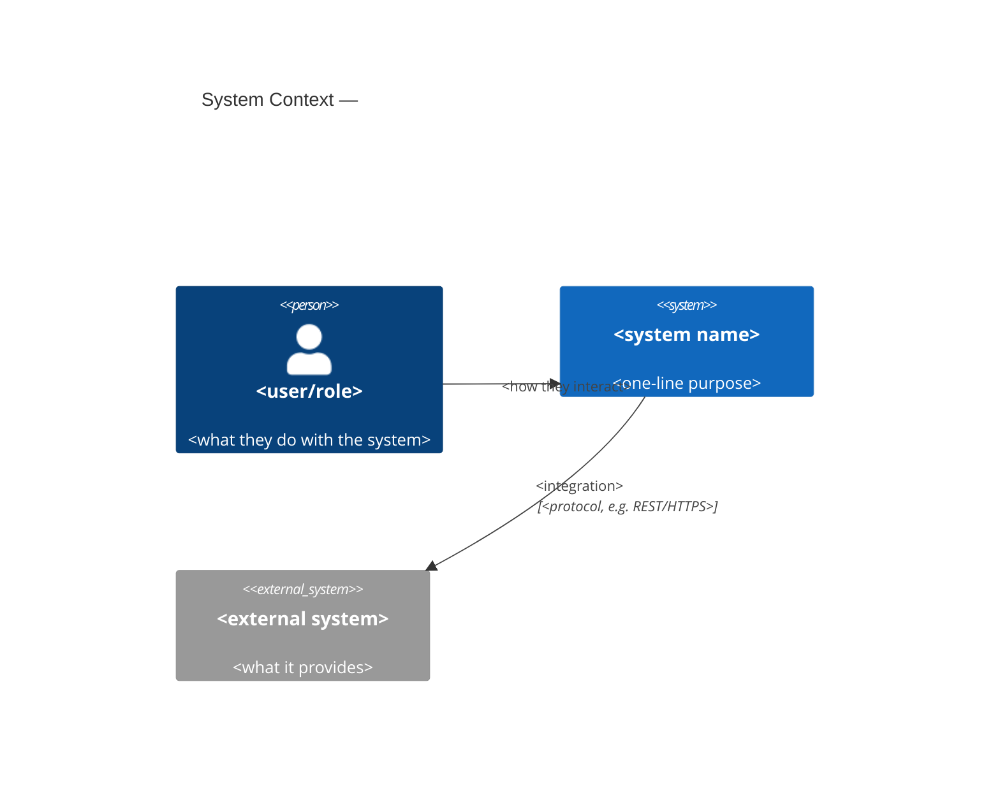
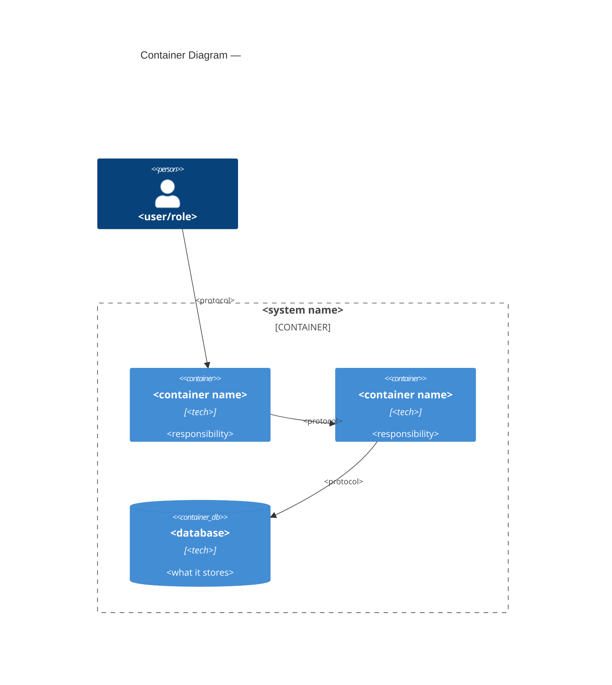
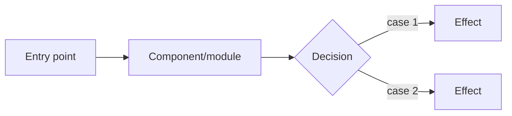

# Architecture Extraction

## Overview

`architecture-extraction` reverse-engineers the architecture of an existing
("brownfield") system directly from its code, producing a portable
architecture document — an arc42-lite skeleton populated with C4 views. The
brownfield rule that governs this whole skill: **document before touching**.
Nothing about the analyzed system is ever modified here; the output is
paper, not patches.

This skill is invoked in two situations: (1) as a standalone request to
understand or document an existing system, or (2) as the reconnaissance step
before extending a system the agent doesn't yet have a verified model of —
in which case its output becomes verified context for `product-brief`
(see Termination).

Every skill that touches a real codebase without a human curating every
line risks presenting guesses as facts; this skill's core discipline against
that risk — calibrated certainty — is stated once, in full, under
Cross-Cutting Rules below.

## Step 0 — Access Detection (Graphify Layer)

Decide the access layer before starting reconnaissance, and announce it to
the user. Never abort because Graphify is unreachable — this is the pattern
already established by `ui-design`'s layered access to Stitch, applied here
to Graphify.

| Layer | Condition | Behavior |
|-------|-----------|----------|
| 1. Graphify | `graphify` CLI available, or installs trivially (`uv tool install graphifyy` or `pip install graphifyy`, bounded attempt) | Run on repo → use `graph.json` / `GRAPH_REPORT.md` as verified structural base. EXTRACTED edges → "verified"; INFERRED edges → "inferred — confirm with owner". |
| 2. Manual | Graphify absent or install fails/times out | Agent-driven repo reconnaissance. Everything is "inferred" unless cited to file:line. |

Detection procedure: check `command -v graphify` first. If absent, **tell
the user before attempting anything** — one line: "Graphify isn't installed;
attempting a one-time install (`uv tool install graphifyy` / `pip install
graphifyy`) to speed this up — falling back to manual reconnaissance if it
fails." Then attempt exactly one bounded install, with a short timeout. On
any failure — missing tool, network error, timeout, non-zero exit — stop
trying immediately and drop to Layer 2, no retry, no second package manager
attempted. Announce whichever layer ends up active: *"Architecture
extraction: Graphify (layer 1)"* or *"Architecture extraction: manual
reconnaissance (layer 2)"*.

**Validate Graphify's output before trusting it.** A successful (exit-0)
`graphify` run is necessary but not sufficient — before treating `graph.json`
as the verified structural base, confirm it actually parses as JSON and
contains the expected top-level shape (nodes/edges with `EXTRACTED`/
`INFERRED` tags). If it doesn't — corrupted output, an unexpected format
from a newer/older Graphify version, a truncated file — treat this exactly
like a Graphify failure: drop to Layer 2, do not attempt to partially parse
or guess at malformed tool output.

**Dependency rule (R11/R11.1/R11.2 — non-negotiable):** *Layer 2 is the
contract: this skill is fully functional with zero external tools. Graphify
is an opportunistic accelerator — if unavailable, degrade silently, never
error, never ask the user to install anything as a prerequisite. No paid
services, no mandatory auth, nothing that cannot run in a sandboxed cloud
environment.*

The two layers change **only** the verified/inferred ratio of the resulting
document, never its structure or completeness. A Layer 2 report covers the
exact same phases and sections as a Layer 1 report — it simply carries more
"inferred — confirm with owner" tags where Layer 1 would have had
tool-verified "EXTRACTED" edges.

## Step 0b — Diagram Layer (mermaid-diagrams)

C4 and flow diagrams in this skill's output are Mermaid. `mermaid-diagrams`
is now a registry skill, shipped on-signal in the baseline `dev` bundle —
guaranteed present in standard installations. It is still treated with the
same layered access discipline as Graphify, never as an unconditional
dependency, because partial installs (project-scoped registries that don't
include `dev`, or a stripped-down install) may not have it — the inline
fallback exists for exactly that case.

| Layer | Condition | Behavior |
|-------|-----------|----------|
| 1. `mermaid-diagrams` skill | Listed among available skills | Invoke it for C4 Context/Container/Component syntax, sequence diagrams for key flows, and ERD syntax for the data model. |
| 2. Inline fallback | Not installed (partial install without the `dev` bundle) | Use the Mermaid syntax embedded directly below — no external reference needed. |

**Inline C4 Context fallback:**



**Inline C4 Container fallback:**



**Inline key-flow fallback (flowchart, when a sequence diagram is overkill):**



## Phase 1 — Reconnaissance

Establish the shape of the system before extracting any view.

- **Stack.** Identify languages, frameworks, and runtimes from manifests and
  lockfiles (`package.json`, `pyproject.toml`, `go.mod`, `Cargo.toml`,
  `pom.xml`, Dockerfiles, CI config). Layer 1: read straight from
  `graph.json`. Layer 2: cite the manifest file and line.
- **Modules.** Identify the top-level module/package boundaries and what
  each one owns — the directory structure that maps to logical
  responsibility, not just physical folders.
- **Boundaries.** Identify where this system's ownership ends: external
  APIs it calls, systems that call it, shared infrastructure (queues,
  databases, auth providers) it depends on but doesn't own.
- **Entry points.** Identify how execution starts: HTTP routes/controllers,
  CLI commands, message consumers, scheduled jobs, `main`/bootstrap files.

## Phase 2 — View Extraction

Populate the arc42-lite skeleton with C4 views and the artifacts that make
them concrete:

- **Context view (C4 Level 1).** Who/what interacts with the system from
  outside: user roles, external systems, third-party services. One Mermaid
  `C4Context` diagram (Step 0b) plus a table of each external relationship
  with its direction and protocol.
- **Container view (C4 Level 2).** The deployable/runnable units inside the
  system boundary: web app, API service, workers, databases, queues, and
  the technology and responsibility of each. One Mermaid `C4Container`
  diagram plus a table (container, tech, responsibility, verified/inferred).
- **Key flows.** 2–5 representative request or event flows chosen for
  coverage (the primary happy path, the most complex conditional path, and
  any flow that crosses container boundaries). Each as a sequence diagram
  or flowchart (Step 0b), with each step attributed to a real component.
- **Data model.** The persisted entities, their relationships, and the
  storage technology backing them — an ERD-style summary when a database is
  present, or a plain entity list with fields and ownership when it isn't.
- **Archaeological ADR.** Architectural decisions that are *visible in the
  code* even though no one wrote them down: the framework/pattern choice
  itself (e.g. "layered service architecture", "CQRS-flavored handlers"),
  naming or module conventions enforced structurally, migration history
  that reveals a past decision (e.g. a rewritten data-access layer), and
  any convention a linter/config enforces. Each entry is framed as a small
  ADR (context, decision, consequence) but tagged **inferred** — it records
  what the code implies was decided, not a decision anyone confirmed was
  intentional, until Phase 3 says otherwise.

Every claim in this phase carries its provenance tag: `verified` (Graphify
EXTRACTED, or a direct file:line citation the agent read itself) or
`inferred` (Graphify INFERRED, or a conclusion drawn without a pinned
citation).

## Phase 3 — Validation with the User

Nothing inferred is delivered as settled. Walk the user through every item
tagged `inferred` — the archaeological ADRs first (they're the highest-risk
inferences), then any container, flow, or data-model claim that Layer 2
couldn't pin to a citation, then any Graphify `INFERRED` edge.

For each: the user confirms it, corrects it, or flags it as still unknown
(carried forward as an explicit open item, never silently dropped). Update
the provenance tag accordingly — a confirmed `inferred` item becomes
`verified (confirmed by owner)`; a corrected one is rewritten and re-tagged;
an unconfirmed one stays `inferred` and lands in the open-decisions ledger
(Phase 4).

## Phase 4 — Delivery

Deliver a single portable `.md` file. It carries the **same frontmatter
contract** as every other product-layer artifact (`skills/readiness-gate/references/brief-contract.md`,
R5.3), populated for this mode:

```yaml
---
awm: product-brief
schema: 1
title: <system name> — Architecture Extraction
mode: extraction
readiness: n/a
created: YYYY-MM-DD
updated: YYYY-MM-DD
open_decisions: [DA-1, DA-3]
project: <slug or null>
---
```

**On `readiness` for extraction reports.** See
`skills/readiness-gate/references/brief-contract.md` for the full rule —
in short, extraction reports are never submitted to the G1–G9 gate, so this
skill writes the contract's defined `readiness: n/a`, never a self-authored
`draft`/`ready`. Completeness of validation is tracked instead by Phase 3:
an extraction doc with items still sitting in `open_decisions` simply means
Phase 3 isn't finished, visible directly in the ledger rather than encoded
into the `readiness` field.

**On body structure.** R5.3 requires frontmatter parity with other
product-layer artifacts, not body parity — an extraction report's body is
purpose-built for architecture, not the 12 business-oriented sections a
`product-brief` carries (Business need, JTBD-style Users, Processes,
Requirements, Releases have no home in an architecture document). The body
reuses only the ID-traceability discipline: every unconfirmed inference
gets a `DA-#` entry in the frontmatter's `open_decisions`, with a `blocks`
note (what depends on resolving it — e.g. "blocks: extension into payments
module"). The body itself is:

1. **System Context** — narrative + `C4Context` diagram + external
   relationship table.
2. **Containers** — narrative + `C4Container` diagram + container table.
3. **Key Flows** — one diagram + short narrative per flow.
4. **Data Model** — entity list/ERD + storage technology.
5. **Archaeological ADRs** — one entry per inferred decision (context,
   decision, consequence, provenance tag).
6. **Open Decisions / Inferred Items Ledger** — every `DA-#` referenced in
   frontmatter, with its citation (file:line or Graphify edge), status
   (confirmed / corrected / still inferred), and `blocks` note.
7. **Technical Debt & Extension Register** — anything Phase 2–3 surfaced
   that isn't a blocking open decision but is worth tracking: shortcuts,
   missing tests around a flow, a container doing more than one job,
   outdated dependencies visible in manifests.

## Cross-Cutting Rules

- **Calibrated certainty (inherited from `brief-spec`'s non-assumption
  mandate).** Every claim is tagged `verified` or `inferred` at the point
  it's written, never left ambiguous. Graphify EXTRACTED and direct
  file:line citations are `verified`; everything else is `inferred` until
  Phase 3 confirms it. No claim is asserted with the syntax of certainty
  beyond what its tag supports.
- **Read-only, always.** This skill never edits, refactors, formats, or
  otherwise modifies the analyzed system — not even a "harmless" cleanup
  noticed along the way. Its only output is the architecture document
  itself. Findings that look like they need fixing are recorded in the
  Technical Debt & Extension Register (Phase 4), not acted on.
- **No repo, no invention.** If no repository is accessible (not attached,
  no path given, nothing checked out), ask the user for the concrete input
  — a repo to add, a local path, existing docs to seed from — rather than
  fabricating a plausible-looking architecture. An extraction document
  describing a system the agent never actually read is worse than no
  document.

## Termination

The architecture document is delivered as a file, every inferred item has
either been validated in Phase 3 or is carried forward explicitly in the
Open Decisions / Inferred Items Ledger.

- **If the goal was to extend the system:** chain explicitly to
  `product-brief` (`skills/product-brief/SKILL.md`) — do not stop and wait
  for the user to ask. Pass the delivered architecture document as verified
  context (R2.1): the system's containers, data model, and confirmed
  constraints are now known facts `product-brief` can build on directly,
  narrowing what its own non-assumption mandate has to leave open.
- **If the extraction revealed technical debt worth evaluating:** offer to
  invoke `architecture-assessment` next, using the Technical Debt &
  Extension Register as its starting input — phrase this as an offer, since
  `architecture-assessment`'s own interface isn't assumed here.
- Never chain silently and never chain to both in parallel — per R2.1, one
  explicit handoff at a time, named to the user, not inferred by them.
