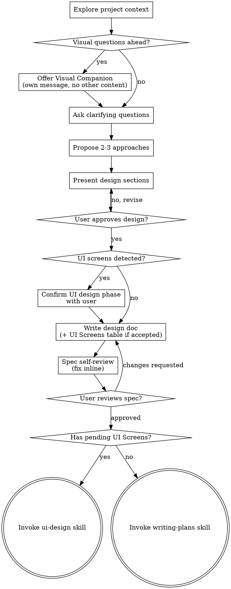

# Brainstorming Ideas Into Designs

## Overview

Help turn ideas into fully formed designs and specs through natural collaborative dialogue.

Start by understanding the current project context, then ask questions one at a time to refine the idea. Once you understand what you're building, present the design and get user approval.

<HARD-GATE>
Do NOT invoke any implementation skill, write any code, scaffold any project, or take any implementation action until you have presented a design and the user has approved it. This applies to EVERY project regardless of perceived simplicity.
</HARD-GATE>

## Brief Preload Mode

**Detection.** At the start of the session, check whether the context contains a document carrying the `awm: product-brief` discriminator in its frontmatter (see `skills/readiness-gate/references/brief-contract.md`) with `mode: brief`. This is the only artifact shape Brief Preload Mode applies to — a `mode: brief` document is the product of `product-brief`, and only that document carries the full contract body (`N#`, `RF-x.y`/`RNF-x.y`, Out of scope, `DA-#`, etc.) that this mode maps into a design.

Do **not** enter Brief Preload Mode for `mode: discovery`, `mode: assessment`, or `mode: extraction` documents:
- A `mode: discovery` document in context is the partial-summary artifact `product-discovery` writes when the user stops before all five phases are covered (see its Termination section) — open phases, not requirements. It has no `RF/RNF` section to seed `## Requirements` from. Treat it as project context/notes, the same as any other file explored in step 1, never as a preload source.
- `mode: assessment` and `mode: extraction` reports are architecture content (context/container views, findings), never gated by `readiness-gate`, and carry no brief-shaped `RF`/`RNF`/`DA-#` content — mapping them into `## Requirements` would be nonsensical.

**When a `mode: brief` document is found**, invoke `readiness-gate` to re-verify it — never trust the document's own stored `readiness` seal, even if it already reads `ready` (the gate always re-runs; see `skills/readiness-gate/SKILL.md`, R7/R7.2).
- Re-verified `ready` → enter Brief Preload Mode.
- Re-verified `draft` → inform the user of the gaps `readiness-gate` reports and suggest running `product-process` (or `product-brief` directly) to close them first. Continue in Brief Preload Mode only if the user insists — in that case the brief is used as notes to accelerate questioning, not as a certified source, and every gap the gate flagged still needs to be asked about as if unanswered.

**Mapping (R8).** Once in Brief Preload Mode, pre-populate this session's understanding from the brief before asking anything:

| Brief section | Feeds into |
|---|---|
| `N#` business-need entries / business cases | Context and purpose (what step 1, "Explore project context," would otherwise have to build up from scratch) |
| `RF-x.y` / `RNF-x.y` | Seed of the `## Requirements` (EARS) section — carry the ID forward, restate in EARS form |
| Out of scope | Non-goals |
| Open `DA-#` decisions | The first clarifying questions to ask |

**Operational rule (R8.1).** Before asking any clarifying question, check whether the brief already answers it. If it does, record the answer as sourced from the brief (traceable by ID: "from brief N3") and do NOT ask it.

**Gates stay intact (R8.2).** Brief Preload Mode changes *what starting material* this skill works from — it never changes what this skill still owes the process: technical validation against the real repo, design approval, and spec self-review all still run exactly as they do without a brief. **The brief accelerates; it never exempts.**

**Without a brief in context**, this skill behaves exactly as before this section existed — no change to the checklist, the process flow, or any gate.

## Anti-Pattern: "This Is Too Simple To Need A Design"

Every project goes through this process. A todo list, a single-function utility, a config change — all of them. "Simple" projects are where unexamined assumptions cause the most wasted work. The design can be short (a few sentences for truly simple projects), but you MUST present it and get approval.

## Checklist

You MUST create a task for each of these items and complete them in order:

1. **Explore project context** — check files, docs, recent commits
1a. **Brief preload check** — if a `mode: brief` document carrying the `awm: product-brief` discriminator is in context, enter Brief Preload Mode (see section above; other modes are explicitly excluded there)
2. **Offer visual companion** (if topic will involve visual questions) — this is its own message, not combined with a clarifying question. See the Visual Companion section below.
3. **Ask clarifying questions** — one at a time, understand purpose/constraints/success criteria; do not exit this phase while any requirement still has an open ambiguity (see Clarify gate)
4. **Propose 2-3 approaches** — with trade-offs and your recommendation
5. **Present design** — in sections scaled to their complexity, get user approval after each section
6. **UI Screen detection** — during/after presenting the design, evaluate if the feature needs UI screens (see the UI Screen Detection section)
7. **Write design doc** — save to `docs/plans/YYYY-MM-DD-<topic>-design.md` with the `## Requirements` (EARS) section as its durable head (see below), plus the `## UI Screens` table when applicable, and commit
8. **Spec self-review** — quick inline check for placeholders, contradictions, ambiguity, scope, and EARS/ID validity (see below)
9. **User reviews written spec** — ask the user to review the spec file before proceeding
10. **Transition to next step** — if the design doc has `## UI Screens` with pending screens, invoke `ui-design`; otherwise invoke `writing-plans`

## Process Flow



**The terminal state is invoking either `ui-design` or `writing-plans`:**
- If the design doc contains a `## UI Screens` section with pending screens → invoke `ui-design`
- Otherwise → invoke `writing-plans`

Do NOT invoke any other implementation skill.

## The Process

**Understanding the idea:**

- Check out the current project state first (files, docs, recent commits)
- Before asking detailed questions, assess scope: if the request describes multiple independent subsystems (e.g., "build a platform with chat, file storage, billing, and analytics"), flag this immediately. Don't spend questions refining details of a project that needs to be decomposed first.
- If the project is too large for a single spec, help the user decompose into sub-projects: what are the independent pieces, how do they relate, what order should they be built? Then brainstorm the first sub-project through the normal design flow. Each sub-project gets its own spec → plan → implementation cycle.
- For appropriately-scoped projects, ask questions one at a time to refine the idea
- Prefer multiple choice questions when possible, but open-ended is fine too
- Only one question per message - if a topic needs more exploration, break it into multiple questions
- Focus on understanding: purpose, constraints, success criteria

**Exploring approaches:**

- Propose 2-3 different approaches with trade-offs
- Present options conversationally with your recommendation and reasoning
- Lead with your recommended option and explain why

**Presenting the design:**

- Once you believe you understand what you're building, present the design
- Scale each section to its complexity: a few sentences if straightforward, up to 200-300 words if nuanced
- Ask after each section whether it looks right so far
- Cover: architecture, components, data flow, error handling, testing
- Be ready to go back and clarify if something doesn't make sense

**Design for isolation and clarity:**

- Break the system into smaller units that each have one clear purpose, communicate through well-defined interfaces, and can be understood and tested independently
- For each unit, you should be able to answer: what does it do, how do you use it, and what does it depend on?
- Can someone understand what a unit does without reading its internals? Can you change the internals without breaking consumers? If not, the boundaries need work.
- Smaller, well-bounded units are also easier for you to work with - you reason better about code you can hold in context at once, and your edits are more reliable when files are focused. When a file grows large, that's often a signal that it's doing too much.

**Working in existing codebases:**

- Explore the current structure before proposing changes. Follow existing patterns.
- Where existing code has problems that affect the work (e.g., a file that's grown too large, unclear boundaries, tangled responsibilities), include targeted improvements as part of the design - the way a good developer improves code they're working in.
- Don't propose unrelated refactoring. Stay focused on what serves the current goal.

## Requirements Section (EARS)

The design doc opens with a durable `## Requirements` section **before** the design sections: structured, testable acceptance criteria in EARS notation (Easy Approach to Requirements Syntax). This separates the WHAT (requirements) from the HOW (design), so the later phases — TDD, traceability, fresh-context QA — have atomic criteria to verify against instead of prose.

**EARS templates** — pick the one that fits each requirement:

| Pattern | Template | Use for |
|---------|----------|---------|
| Ubiquitous | `THE <system> SHALL <response>` | Always-on properties |
| Event-driven | `WHEN <trigger>, THE <system> SHALL <response>` | Response to an event |
| State-driven | `WHILE <state>, THE <system> SHALL <response>` | Behavior during a state |
| Optional feature | `WHERE <feature is included>, THE <system> SHALL <response>` | Behavior tied to an optional feature |
| Unwanted behavior | `IF <trigger>, THEN THE <system> SHALL <response>` | Error / edge / invalid-input handling |
| Complex | Combine the above, e.g. `WHILE <state>, WHEN <trigger>, THE <system> SHALL <response>` | Compound conditions |

**Prioritize the `IF/THEN` (unwanted behavior) template.** It forces you to specify edge cases, invalid inputs, and error paths up front — exactly the class of bug (boundary handling, `Infinity`/`NaN`, missing validation) that robustness review otherwise discovers late. EARS moves it upstream into the spec.

**Requirement IDs.** Number every requirement with a stable ID (`R1`, `R2`, `R1.1`, …). These IDs are the spine of traceability: `writing-plans` tags each task with the IDs it satisfies, and `post-implementation-qa` uses them as a completeness checklist. A requirement without an ID cannot be traced.

**Keep it terse.** Requirements are bullet-point EARS statements, never long prose — a durable head for the spec, not an essay.

### Clarify gate (zero open ambiguity)

The requirements are the exit gate of the questioning phase. Do NOT move to the design sections while any requirement still carries an open ambiguity. Use the existing one-question-at-a-time loop to resolve each unknown until there are zero open ambiguities, then write the requirements and proceed. Ambiguity that survives into the design becomes rework in implementation — resolve it at spec time.

### Tier (anti-waterfall guardrail)

The EARS + IDs structure scales with risk, like the rest of the process:

- **Multi-file or risky features** → the `## Requirements` section is mandatory.
- **Trivial one-file diffs** → the section is skippable (intentionally absent); a one-line bullet of intent replaces it, no `## Requirements` section.

This mirrors the "Too Simple" anti-pattern: simple doesn't exempt you from process, but the process scales down. Never pad a trivial change with prose requirements.

## After the Design

**Documentation:**

- Write the validated design (spec) to `docs/plans/YYYY-MM-DD-<topic>-design.md`
  - (User preferences for spec location override this default)
- Use elements-of-style:writing-clearly-and-concisely skill if available
- Commit the design document to git

**Spec Self-Review:**

After writing the spec document, look at it with fresh eyes:

1. **Placeholder scan:** Any "TBD", "TODO", incomplete sections, or vague requirements? Fix them.
2. **Internal consistency:** Do any sections contradict each other? Does the architecture match the feature descriptions?
3. **Scope check:** Is this focused enough for a single implementation plan, or does it need decomposition?
4. **Ambiguity check:** Could any requirement be interpreted two different ways? If so, pick one and make it explicit.
5. **EARS/ID check:** Is every requirement in EARS notation and 1:1 testable? Does each carry a stable ID (`R1`, `R1.1`, …)? If a requirement can't be phrased as a single testable `SHALL`, split it until it can.

Fix any issues inline. No need to re-review — just fix and move on.

**User Review Gate:**

After the spec review loop passes, ask the user to review the written spec before proceeding:

> "Spec written and committed to `<path>`. Please review it and let me know if you want to make any changes before we start writing out the implementation plan."

Wait for the user's response. If they request changes, make them and re-run the spec review loop. Only proceed once the user approves.

**Next step routing:**

- If the design doc has a `## UI Screens` section with pending screens → invoke `ui-design`
- Otherwise → invoke `writing-plans` to create a detailed implementation plan
- Do NOT invoke any other skill.

## UI Screen Detection

During the "Presenting the design" phase, evaluate whether the feature involves UI screens that would benefit from visual design with Stitch:

**Criteria (all must be true):**
1. The feature has direct user interaction (not purely backend, API, or CLI)
2. It requires new screens or significant layout changes
3. The visual complexity justifies a designer (a button text change does not)

**If UI screens are detected:**

After the user approves the full design, identify any UI screens detected. Before finalizing the design doc, ask the user:

> "I detected N screens that could benefit from UI design with Stitch: [list screens]. Do you want to go through the UI design phase or skip it?"

- **User accepts** → write the design doc including a `## UI Screens` section with a table:

```markdown
## UI Screens

| Screen | Description | Device | Status |
|--------|-------------|--------|--------|
| [name] | [description] | [MOBILE/DESKTOP/TABLET] | pending |
```

- **User skips** → write the design doc WITHOUT the `## UI Screens` section. Then invoke `writing-plans` directly.

**If no UI screens detected:** Do not add the section. Proceed directly to `writing-plans`.

> **Routing contract:** The `development-process` orchestrator and the `ui-design` skill route based on the presence of a `## UI Screens` table with at least one row where `Status` is exactly `pending`. Always use `pending` (lowercase) as the initial status value — using any other value will break routing.

## Key Principles

- **One question at a time** - Don't overwhelm with multiple questions
- **Multiple choice preferred** - Easier to answer than open-ended when possible
- **YAGNI ruthlessly** - Remove unnecessary features from all designs
- **Explore alternatives** - Always propose 2-3 approaches before settling
- **Incremental validation** - Present design, get approval before moving on
- **Be flexible** - Go back and clarify when something doesn't make sense

## Visual Companion

A browser-based companion for showing mockups, diagrams, and visual options **during brainstorming**. Available as a tool — not a mode. Accepting the companion means it's available for questions that benefit from visual treatment; it does NOT mean every question goes through the browser.

**Visual Companion vs `ui-design`:** these are different phases.
- **Visual Companion** is for *discovery-time* questions: low-fidelity wireframes used as input to a brainstorming choice (e.g. "which layout direction feels right?"). Local HTML, zero API cost, mockups are disposable.
- **`ui-design`** is for *production-time* screens: high-fidelity Stitch generations consumed by implementation. Invoked AFTER the design doc is written, when a `## UI Screens` table with `pending` rows exists.

They are complementary and run at different points in this skill: Visual Companion may be used at step 2 onward; `ui-design` is the terminal transition at step 10.

**Offering the companion:** When you anticipate that upcoming questions will involve visual content (mockups, layouts, diagrams), offer it once for consent:
> "Some of what we're working on might be easier to explain if I can show it to you in a web browser. I can put together mockups, diagrams, comparisons, and other visuals as we go. This feature is still new and can be token-intensive. Want to try it? (Requires opening a local URL)"

**This offer MUST be its own message.** Do not combine it with clarifying questions, context summaries, or any other content. The message should contain ONLY the offer above and nothing else. Wait for the user's response before continuing. If they decline, proceed with text-only brainstorming.

**Per-question decision:** Even after the user accepts, decide FOR EACH QUESTION whether to use the browser or the terminal. The test: **would the user understand this better by seeing it than reading it?**

- **Use the browser** for content that IS visual — mockups, wireframes, layout comparisons, architecture diagrams, side-by-side visual designs
- **Use the terminal** for content that is text — requirements questions, conceptual choices, tradeoff lists, A/B/C/D text options, scope decisions

A question about a UI topic is not automatically a visual question. "What does personality mean in this context?" is a conceptual question — use the terminal. "Which wizard layout works better?" is a visual question — use the browser.

If they agree to the companion, read the detailed guide before proceeding:
`skills/brainstorming/visual-companion.md`

## Specialist Skills Awareness

During the approach exploration phase (Propose 2-3 approaches), if you detect the conversation involves decisions of significant complexity in these areas, you may invoke the corresponding specialist skill in **contextual mode** to enrich the discussion:

| Area | Skill | When to invoke |
|------|-------|----------------|
| Architecture design | `architecture-advisor` | Designing system architecture, choosing patterns, defining components, evaluating integrations |
| CI/CD pipeline | `cicd-proposal-builder` | Defining delivery pipeline, branching strategy, environments, deploy strategy |
| Non-functional requirements | `nfr-checklist-generator` | Identifying and prioritizing NFRs early in design |
| Technology selection | `technology-evaluator` | Evaluating and comparing technology options with structured criteria |

**Rules:**
- Only invoke for decisions of **significant complexity** — do not invoke for trivial choices.
- Invoke in **contextual mode** — the specialist answers a specific question and returns control to you.
- The specialist's output is integrated into the design document you are building, not written as a separate artifact.
- You remain in control of the brainstorming flow. The specialist is a consultant, not a replacement.
