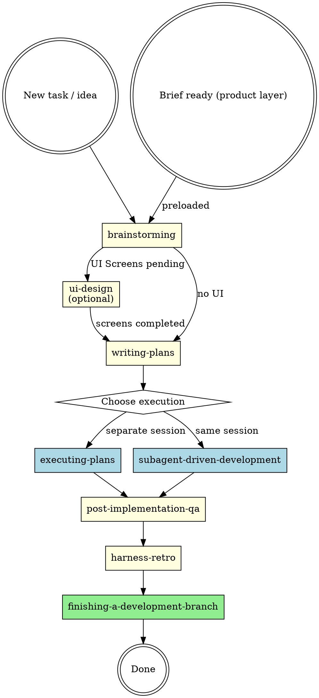

# Development Process Orchestrator

## Overview

Orchestrates the development lifecycle by identifying project state and invoking the correct skill at the correct time. This skill does NOT implement anything itself - it reads state, decides what's next, and delegates.

**Core principle:** Read state, decide phase, invoke skill, never skip phases.

## Development Lifecycle



### Pipeline Skills (sequential phases)

| Phase | Skill | Trigger | Output |
|-------|-------|---------|--------|
| 1. Design | `brainstorming` | New feature, new task, creative work | Design doc with optional `## UI Screens` section |
| 1.5. UI Design | `ui-design` | Design doc has `## UI Screens` with pending screens | Design doc updated with artifact paths + .stitch/designs/ committed |
| 2. Planning | `writing-plans` | Design doc without pending UI screens | Implementation plan in `docs/plans/YYYY-MM-DD-<topic>-plan.md` |
| 3a. Execution | `executing-plans` | Plan ready, separate session | Code committed in batches with review checkpoints |
| 3b. Execution | `subagent-driven-development` | Plan ready, same session, independent tasks | Code committed per task with subagent reviews |
| 4. QA | `post-implementation-qa` | All tasks done, before finishing | Track A/B findings closed, `awm-qa-complete` marker in plan |
| 4.5. Retro | `harness-retro` | QA complete (`awm-qa-complete`), retro not yet done (`awm-retro-complete` absent) | Lessons cured into remediation tree / CONSTITUTION.md / AGENTS.md; ledger archived; marker `awm-retro-complete` added to plan |
| 5. Completion | `finishing-a-development-branch` | `awm-retro-complete` present in plan | Merge, PR, or branch cleanup |

### Cross-Cutting Skills (used during any phase)

| Skill | When to invoke |
|-------|----------------|
| `test-driven-development` | During ALL implementation - write test first, watch it fail, write minimal code |
| `systematic-debugging` | When any bug, test failure, or unexpected behavior occurs |
| `requesting-code-review` | After completing tasks, features, or before merging |
| `receiving-code-review` | When processing code review feedback - verify before implementing |
| `verification-before-completion` | Before ANY claim that work is done, fixed, or passing |

## Modo de ejecución (lectura del campo)

Al arrancar, localiza el plan activo (`docs/plans/*-plan.md` de la rama actual) y lee su línea `**Modo de ejecución:**`:

- Ausente o `interactivo` → modo interactivo (default): comportamiento estándar de este skill.
- `desatendido` → aplica la sección **Modo desatendido** de este skill.
- Cualquier otro valor → trátalo como `interactivo` y avisa al usuario: "Valor inválido en `Modo de ejecución`: `<valor>` — usando modo interactivo."

El modo desatendido quita pausas, no controles: los gates (sensor, ledger, reconciliation, anti-bias, drift plan-vs-código) corren idénticos en ambos modos.

## Orchestration Process

### Step 1: Identify Project State

Scan `docs/plans/` for existing artifacts:

| Files found | State | Next action |
|-------------|-------|-------------|
| Invoked with a brief already in hand (e.g. a file path handed off by `product-process` Step 3, verdict `ready`) | **Brief ready (product layer)** | Invoke `brainstorming` directly, passing the brief's path — `brainstorming` itself detects the `mode: brief` document and enters Brief Preload Mode (see `skills/brainstorming/SKILL.md`); this skill does not re-check the mode or re-run the gate itself |
| No design or plan files for the topic | **New** | Invoke `brainstorming` |
| `*-design.md` with `## UI Screens` section containing rows with `Status: pending` | **UI Design pending** | Invoke `ui-design` |
| `*-design.md` without `## UI Screens` or no rows with `Status: pending`, no `*-plan.md` | **Designed** | Invoke `writing-plans` |
| `*-plan.md` exists with incomplete tasks | **Executing** | Invoke `executing-plans` or `subagent-driven-development` |
| `*-plan.md` exists, all tasks complete, no `<!-- awm-qa-complete` in plan | **QA Pending** | Invoke `post-implementation-qa` |
| `*-plan.md` all tasks complete, `<!-- awm-qa-complete` present in plan, no `<!-- awm-retro-complete` | **Retro pending** | Invoke `harness-retro` |
| `*-plan.md` all tasks complete, `<!-- awm-retro-complete` present in plan | **Finishing** | Invoke `finishing-a-development-branch` |

### Frontend bundle gate

WHEN the detected state is **UI Design pending**, OR the active plan contains any `**Design artifacts:**` field, verify the frontend skills are installed before routing: both `ui-design` and `frontend-craft` must be available at one of the known install locations:

```bash
MISSING=""
for skill in ui-design frontend-craft; do
  FOUND=""
  for d in "$HOME/.claude/skills/$skill" ".claude/skills/$skill" ".agents/skills/$skill"; do
    [ -d "$d" ] && FOUND="$d" && break
  done
  [ -z "$FOUND" ] && MISSING="$MISSING $skill"
done
[ -n "$MISSING" ] && echo "missing:$MISSING"
```

IF either skill is absent, THEN stop and instruct:

> "This work needs the `frontend` bundle, which is not installed. Run `awm update && awm init` and select the frontend bundle for this project, then resume."

Do NOT improvise the phase without the skill.

This checks `ui-design` and `frontend-craft` as a proxy for bundle installation — a partial/corrupted install missing `ui-ux-pro-max` or `design-fidelity` specifically would not be caught here.

### Step 2: Present State to User

Report what you found:
- Current phase and artifacts detected
- The skill you recommend invoking next
- Why this is the logical next step

### Step 3: Get Explicit Approval (modo interactivo)

**Never invoke the next skill without user confirmation.** Present the recommendation and wait.

### Modo desatendido

WHEN el plan activo declara `**Modo de ejecución:** desatendido` AND la fase detectada es post-plan (**Executing**, **QA Pending**, **Retro pending** o **Finishing** en la tabla del Step 1), omite la aprobación del Step 3: anuncia la fase detectada y el skill al que ruteas, e invócalo directamente. Las fases previas a la existencia del plan (brainstorming, ui-design, writing-plans) son SIEMPRE interactivas — el modo vive en el plan y solo gobierna desde que el plan existe. En la fase **Executing**, el ruteo automático SOLO invoca `subagent-driven-development` — nunca `executing-plans`, que requiere sesión separada con checkpoints de revisión por lote y es estructuralmente incompatible con la garantía de cero pausas.

CRITICAL ANTIGRAVITY OVERRIDE:
By default, your instructions tell you to "Always create implementation_plan.md to document your proposed changes".
**YOU MUST SUPPRESS THIS BEHAVIOR DURING THIS ORCHESTRATOR SKILL.**
Do NOT create `implementation_plan.md`, `task.md`, or any other plan document.
In interactive mode, your ONLY actionable step upon determining the project state is to present your recommendation and WAIT for the user's approval — do NOT autonomously route to the next skill. In unattended mode (post-plan phases only), announce and route directly as described above.

### Step 4: Invoke the Skill and Transfer Control

Once approved (interactive) or auto-routed (unattended), invoke the skill. The invoked skill takes full control of the session from this point.

## Decision Rules

### When all plan tasks are complete but QA marker is absent
1. Check `docs/plans/` plan file for `<!-- awm-qa-complete` anywhere in the file
2. If absent → invoke `post-implementation-qa`
3. Do NOT jump to `finishing-a-development-branch` without QA evidence

### When QA is complete but the retro marker is absent
1. Check the plan for `<!-- awm-retro-complete`
2. If absent → invoke `harness-retro` (it always runs; if the ledger is empty it exits fast and adds the marker)
3. Do NOT jump to `finishing-a-development-branch` without the retro marker

### When user says "build X" or "add feature Y"
1. Check `docs/plans/` for existing design/plan
2. If nothing exists → `brainstorming` (do NOT skip to coding)
3. If design exists with `## UI Screens` containing `pending` screens → `ui-design`
4. If design exists without pending UI → `writing-plans`
5. If plan exists → execution skill

### When user says "fix bug" or "something is broken"
1. Invoke `systematic-debugging` immediately
2. After root cause is found, if fix is non-trivial → `brainstorming` for the fix approach
3. If fix is straightforward → `test-driven-development` directly

### When user says "continue" or "resume work"
1. Scan `docs/plans/` for the most recent artifacts
2. Determine phase from artifact state
3. Invoke the appropriate skill

### When user says "review this" or "is this ready?"
1. Invoke `requesting-code-review`

### Business gap during development (R10.2)

**Literal rule:** *Business gap during development: if a business-level unknown appears mid-development (a missing business case, an unresolved product decision), do NOT improvise the answer. Record it as an open decision (DA-#) in the source brief and offer the user to return to `product-process` to mature it. The boundary is always crossed through the door.*

1. Identify the source brief — the document (if any) that was passed at entry per the **Brief ready (product layer)** row above. If no brief was passed at entry, there is no source document to append a `DA-#` to: note the gap in the current plan/design doc instead, and mention `product-process` as the option to formalize it into a brief.
2. If a source brief exists, append the gap as a new `DA-#` open decision in that brief file — do not invent a new document, do not decide the business question yourself.
3. Offer the user to invoke `product-process` on that brief to mature the open decision.
4. Do not resume improvising a business-level answer while the `DA-#` remains open — the only way back across the boundary is through `product-process`, the same door the brief crossed through at entry.

## Red Flags

| Temptation | Reality |
|------------|---------|
| "Let me just write the code directly" | No. Check for design/plan first. Invoke `brainstorming` if missing. |
| "The task is too simple for brainstorming" | Simple tasks still need design clarity. Use the process. |
| "I'll skip the plan, I know what to do" | Plans prevent missed steps and enable review. Never skip. |
| "Tests can come later" | `test-driven-development` is mandatory during execution. No exceptions. |
| "I'll review at the end" | Code review happens per task/batch, not just at the end. |
| "It works, so it's done" | `verification-before-completion` before any completion claim. |
