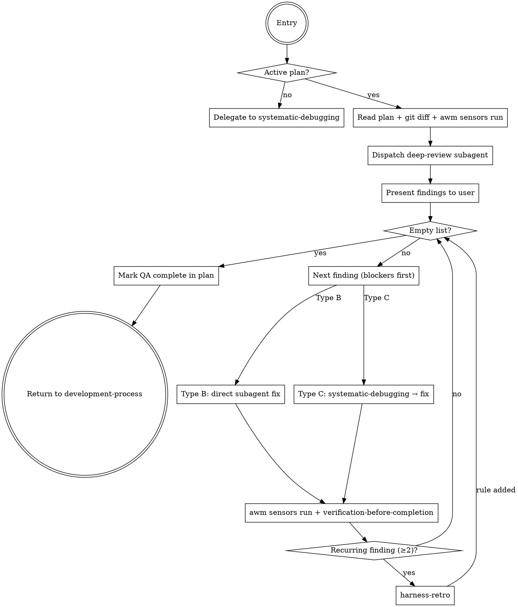

# Post-Implementation QA

**Announce at start:** "I'm using the post-implementation-qa skill to review what was built vs. what was planned."

## Overview

The harness prevents future bugs (preventive). This skill closes bugs found now (corrective). Runs between execution and finishing, replacing the informal "full review before closing" prompt.

**Core principle:** No branch is closed without evidence that what was built matches what was planned AND that the code is correct.

## Two Entry Points

### Entry Point 1 — From development-process (active development)
Invoked when `subagent-driven-development` or `executing-plans` reports all tasks complete. The plan is available in `docs/plans/`.

### Entry Point 2 — Standalone
The user invokes directly when finding a bug or wanting a QA pass without prior development.
- If `*-plan.md` exists for the current branch in `docs/plans/` → use it as reference
- If no plan → delegate directly to `systematic-debugging`

## Finding Types

| Type | Description | Remediation |
|------|-------------|-------------|
| **B — Fidelity** | The plan says X, the code does Y (something missing, something extra, misunderstood) | Correction subagent pointed at the gap, no root cause analysis |
| **C — Quality** | Logic bug, edge case, unexpected behavior | `systematic-debugging` → root cause → subagent fix |

> **Security lens (scope ≠ exemption).** "Documented-out-of-scope" does NOT exempt security/robustness invariants. A public function that silently returns `Infinity`/`NaN`/`undefined`, or that crashes on edge/invalid inputs, is a **Type C finding even if the design declared it out of scope.** Scope excludes *features*, never the robustness floor.

## El Proceso



## Step by Step

### Step 1: Locate the active plan

```bash
git branch --show-current
ls docs/plans/ | grep -v design | sort | tail -5
```

If no plan exists for the current branch → standalone mode → `systematic-debugging`.

### Step 2: Gather evidence

```bash
git diff main...HEAD
awm sensors run
```

### Step 3: Dispatch the deep-review subagent

**Build the prompt FROM the `./deep-review-prompt.md` template** — read the file and inject the context into its structure. An inline prompt written from memory loses the ledger instruction. Inject:
- Texto completo del plan
- Git diff completo de la rama
- Output completo de `awm sensors run`

El subagente retorna JSON con lista de hallazgos clasificados.

- The subagent also logs each finding and win in the ledger via `awm ledger add` (see deep-review-prompt.md), feeding into `harness-retro`.

### Step 4: Present findings to the user

**Ledger gate (before presenting):** run `awm ledger list` and verify that each finding in the JSON has a corresponding entry (phase `post-qa`). If the subagent reported N findings but the ledger did not grow, the learning pipeline is broken — re-dispatch the subagent to emit the missing `awm ledger add` entries before continuing. Do not present findings whose record does not exist.

```
## Hallazgos QA

Type B — Fidelidad (N hallazgos)
  [B1] 🔴 BLOCKER: Missing implementation of X (plan section 3.2)
  [B2] 🟡 IMPORTANT: Feature Y no estaba en el plan

Type C — Calidad (M hallazgos)
  [C1] 🔴 BLOCKER: Edge case Z no manejado (file.ts:45)
  [C2] ⚪ MINOR: Mensaje de error poco claro

Resumen: N Type-B, M Type-C. K blockers.
```

Ask: "Shall we proceed with all findings, or is there any you want to discard?"
Wait for confirmation before starting the fix loop.

### Paso 5: Fix loop (blockers primero, luego importantes, luego minors)

**Para Type B:**
- Dispatch subagent with exact description of the gap + relevant plan section
- No root cause analysis — the gap is clear from the plan
- After the fix: `awm sensors run` + `verification-before-completion`

**For Type C:**
- Invoke `systematic-debugging` → confirmed root cause → dispatch subagent fix
- After the fix: `awm sensors run` + `verification-before-completion`

**Si el mismo hallazgo aparece ≥2 veces:** invocar `harness-retro` antes de continuar.

**Si el usuario descarta un hallazgo:** anotar el motivo y continuar.

### Step 6: Completion gate

Proceed only when ALL:
- [ ] Findings list empty (all resolved or discarded with reason)
- [ ] `awm sensors run` limpio
- [ ] `verification-before-completion` pasado para cada fix

### Step 7: Mark QA complete

Add at the beginning of the plan (first line after the `#` header):
```markdown
<!-- awm-qa-complete: YYYY-MM-DD -->
```

Reportar: "QA completo. N hallazgos encontrados y cerrados. Listo para `finishing-a-development-branch`."

## Iron Law

```
NO "QA COMPLETE" CLAIM WITHOUT:
1. Clean awm sensors run
2. verification-before-completion per each fix
3. Empty list or justified discards
```

## Red Flags

- "Just a quick fix, I don't need to run sensors" → RUN SENSORS
- "The implementation looks fine" → EVIDENCE, not appearances
- "This finding is minor, I'll skip it" → present to user, let them decide
- Mezclar tratamiento Type B y C
- Skipping confirmation before the fix loop
- Olvidar el marker `<!-- awm-qa-complete -->`
- Dispatching the deep-review with an inline prompt instead of the template → the `awm ledger add` instruction is lost
- Presenting findings without verifying that the ledger grew (Step 4 gate)

## Conexiones

| Skill | Rol |
|-------|-----|
| `development-process` | Lo invoca como nueva fase |
| `systematic-debugging` | Para hallazgos Type C |
| `subagent-driven-development` | Ejecuta los fixes |
| `verification-before-completion` | Gate por cada fix |
| `harness-retro` | Si hallazgo es recurrente (≥2) |
| `finishing-a-development-branch` | Next phase when QA is clean |
