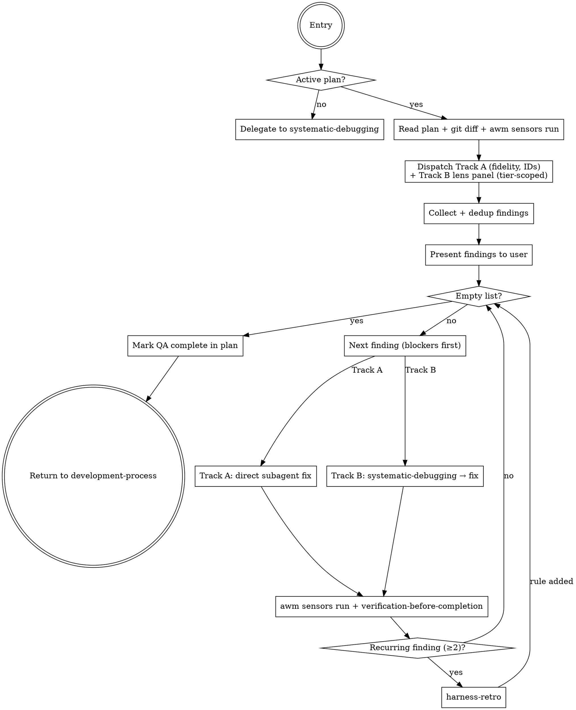

# Post-Implementation QA

**Announce at start:** "I'm using the post-implementation-qa skill to review what was built vs. what was planned."

## Overview

The harness prevents future bugs (preventive). This skill closes bugs found now (corrective). Runs between execution and finishing, replacing the informal "full review before closing" prompt.

**Core principle:** No branch is closed without evidence that what was built matches what was planned AND that the code is correct.

## Modo de ejecución (lectura del campo)

Al arrancar, localiza el plan activo (`docs/plans/*-plan.md` de la rama actual) y lee su línea `**Modo de ejecución:**`:

- Ausente o `interactivo` → modo interactivo (default): comportamiento estándar de este skill.
- `desatendido` → aplica la sección **Modo desatendido** de este skill.
- Cualquier otro valor → trátalo como `interactivo` y avisa al usuario: "Valor inválido en `Modo de ejecución`: `<valor>` — usando modo interactivo."

El modo desatendido quita pausas, no controles: los gates (sensor, ledger, reconciliation, anti-bias, drift plan-vs-código) corren idénticos en ambos modos.

### Modo desatendido

WHEN el modo es `desatendido`: en el Step 4 no preguntes "¿procedemos con todos?" — entra directo al fix loop y corrige TODOS los hallazgos (blockers → important → minors), sin descartes. Todo lo demás es idéntico: ledger gate del Step 4, `awm sensors run` + `verification-before-completion` por cada fix, y el completion gate del Step 6 corren igual en ambos modos.

## Two Entry Points

### Entry Point 1 — From development-process (active development)
Invoked when `subagent-driven-development` or `executing-plans` reports all tasks complete. The plan is available in `docs/plans/`.

### Entry Point 2 — Standalone
The user invokes directly when finding a bug or wanting a QA pass without prior development.
- If `*-plan.md` exists for the current branch in `docs/plans/` → use it as reference
- If no plan → delegate directly to `systematic-debugging`

## Two Tracks

QA runs in two distinct tracks. **Track A** measures *fidelity* against the plan; **Track B** measures *quality* independent of the plan. They answer different questions and must not be collapsed into one "find issues" pass.

### Track A — Fidelity (plan-anchored, ID-driven)

> "The plan promised X — is X actually built and tested?"

Driven by the **requirement IDs** from the spec's `## Requirements` section (produced by `brainstorming`/`writing-plans`). Each `R#` is a completeness-checklist item:
- **Forward gap** — a requirement ID with no implementation or no test → finding.
- **Backward gap** — code with no requirement ID → scope creep → finding.

Without requirement IDs there is nothing precise to measure fidelity against — fall back to reading the plan prose section by section, but say so.

**Remediation:** correction subagent pointed at the gap + the plan section/ID. No root-cause analysis — the gap is clear from the plan.

### Track B — Quality (plan-agnostic, multi-lens)

> "Regardless of what the plan said, is the code sound?"

A quality defect (division by zero → `Infinity`, crash on invalid input) is a defect **even if the plan never mentioned it**. Instead of one monolithic "find all bugs" pass, Track B dispatches a **panel of distinct lenses** — each its own subagent in isolated context, each with a plan-agnostic criterion:

| Lens | Looks for |
|------|-----------|
| **Robustness / Security** | The floor that scope never exempts: silent `Infinity`/`NaN`/`undefined`, crash on boundary/invalid input, missing validation at trust boundaries (user input, external APIs). A public function that silently returns `Infinity`/`NaN`/`undefined`, or crashes on edge/invalid input, is a finding **even if the design declared it out of scope**. Scope excludes *features*, never the robustness floor. |
| **Logic correctness** | Wrong result for valid input, broken invariants, state that can become inconsistent, off-by-one and ordering bugs. |
| **Tests** | Does each requirement have a test? Do tests exercise the `IF/THEN` edge cases from the spec? Empty asserts, tests that can't fail, missing failure-path coverage. |
| **Design fidelity** *(conditional: only when the diff touches UI and `.stitch/designs/` exists)* | Divergence between the implemented screens and their committed design artifacts — invoke the `design-fidelity` skill; its per-element findings enter the fix loop like any other Track B finding |

*(Extensible by tier: add perf / concurrency lenses when the domain warrants. Don't dispatch lenses the change can't possibly trip.)*

**Why a panel and not a bigger single pass:** a single critic in the same model that implemented has a single blind spot; redundant copies of it share that blind spot. Distinct lenses are distinct *external criteria* — diversity of criterion catches failure modes a bigger bucket can't. This is perspective-diverse verification, **not** same-model debate.

**Remediation:** `systematic-debugging` → confirmed root cause → subagent fix.

**Dedup:** the robustness and logic lenses may both flag the same `file:line`. Merge overlapping findings before presenting.

> **The deterministic gate outranks every lens.** No lens may declare "clean" over a red `awm sensors run`. The panel *adds to* the sensor gate; it never overrides it. On any conflict between a lens's judgment and a sensor/test, the sensor wins — fresh context attenuates self-preference bias but does not neutralize it.

## The Process



## Step by Step

### Step 1: Locate the active plan

```bash
git branch --show-current
ls docs/plans/ | grep -v design | sort | tail -5
```

If no plan exists for the current branch → standalone mode → `systematic-debugging`.

### Step 2: Gather evidence

```bash
git diff main...HEAD
awm sensors run
```

Also read the spec's `## Requirements` section to collect the requirement IDs — they are Track A's checklist.

### Step 3: Dispatch the review (both tracks)

**Build every prompt FROM the `./deep-review-prompt.md` template** — read the file and inject the context into its structure. An inline prompt written from memory loses the ledger instruction and the anti-bias header. Inject into each:
- Full plan text + the requirement IDs (for Track A)
- Full git diff of the branch
- Full output of `awm sensors run`

**Track A — one fidelity subagent** using the template's Track A section (IDs as completeness checklist).

**Track B — one subagent per lens**, each in isolated context, using that lens's section of the template. Dispatch them in parallel.

**Tier (which lenses to run):**
- **Trivial single-file diff** → run only the **Robustness/Security** lens (the floor is never skipped) + Track A if requirement IDs exist.
- **Multi-file or critical-correction change** → run the full lens panel.
- Never dispatch a lens the change cannot possibly trip (e.g. no concurrency lens for a pure string-formatting change).
- **Design Fidelity** → dispatch it whenever the diff touches UI AND `.stitch/designs/` artifacts exist for the affected screen(s), regardless of tier (trivial or multi-file) — it is conditional on the UI-diff signal, not on diff size.

Each subagent returns JSON with a list of findings. It also logs each finding and win in the ledger via `awm ledger add` (see deep-review-prompt.md), feeding `harness-retro`.

### Step 4: Collect, dedup, and present to the user

Merge all subagents' findings. **Dedup** overlapping findings (same `file:line` flagged by more than one lens → one finding, note the lenses that agreed).

**Ledger gate (before presenting):** run `awm ledger list` and verify each finding has a corresponding entry (phase `post-qa`). If the subagents reported N findings but the ledger did not grow, the learning pipeline is broken — re-dispatch to emit the missing `awm ledger add` entries before continuing. Do not present findings whose record does not exist.

```
## QA Findings

Track A — Fidelity (N findings)
  [A1] 🔴 BLOCKER: R2.3 not implemented (plan §3.2)
  [A2] 🟡 IMPORTANT: helper added with no requirement ID (backward gap)

Track B — Quality (M findings)
  [B1] 🔴 BLOCKER: splitBill returns Infinity on 0 people (robustness · file.ts:45)
  [B2] 🟡 IMPORTANT: off-by-one on empty range (logic · range.ts:12)
  [B3] ⚪ MINOR: edge case from IF/THEN R4 has no test (tests)

Summary: N Track-A, M Track-B. K blockers.
```

Each Track-B finding is tagged with the lens that raised it.

**Modo interactivo:** Ask: "Shall we proceed with all findings, or is there any you want to discard?" Wait for confirmation before the fix loop.

**Modo desatendido:** no preguntes — entra al fix loop con TODOS los hallazgos (blockers → important → minors), sin descartes.

### Step 5: Fix loop (blockers first, then important, then minors)

**For Track A (fidelity):**
- Dispatch subagent with exact description of the gap + relevant plan section / requirement ID
- No root-cause analysis — the gap is clear from the plan
- After the fix: `awm sensors run` + `verification-before-completion`

**For Track B (quality):**
- Invoke `systematic-debugging` → confirmed root cause → dispatch subagent fix
- After the fix: `awm sensors run` + `verification-before-completion`

**If the same finding appears ≥2 times:** invoke `harness-retro` before continuing.

**If the user discards a finding:** record the reason and continue.

### Step 6: Completion gate

Proceed only when ALL:
- [ ] Findings list empty (all resolved or discarded with reason)
- [ ] `awm sensors run` clean
- [ ] `verification-before-completion` passed for each fix

### Step 7: Mark QA complete

Add at the beginning of the plan (first line after the `#` header):
```markdown
<!-- awm-qa-complete: YYYY-MM-DD -->
```

Report: "QA complete. N findings found and closed. Ready for `finishing-a-development-branch`."

## Iron Law

```
NO "QA COMPLETE" CLAIM WITHOUT:
1. Clean awm sensors run  (no lens overrides a red sensor)
2. verification-before-completion per each fix
3. Empty list or justified discards
```

## Red Flags

- "Just a quick fix, I don't need to run sensors" → RUN SENSORS
- "The implementation looks fine" → EVIDENCE, not appearances
- "This finding is minor, I'll skip it" → present to user, let them decide
- Collapsing Track A and Track B into one pass, or treating their fixes the same way
- Running Track B as one "find all bugs" agent instead of distinct lenses → the blind spot returns
- Skipping the Robustness/Security lens because the design "declared it out of scope" → the floor is never out of scope
- A lens declaring clean while `awm sensors run` is red → the sensor wins
- Skipping confirmation before the fix loop (modo interactivo — en desatendido la confirmación se omite por diseño)
- Forgetting the `<!-- awm-qa-complete -->` marker
- Dispatching a review with an inline prompt instead of the template → the `awm ledger add` instruction and the anti-bias header are lost
- Presenting findings without verifying that the ledger grew (Step 4 gate)
- "UI diff with `.stitch/designs/` present, no fidelity report" → QA is incomplete — dispatch the design-fidelity lens before closing

## Connections

| Skill | Role |
|-------|------|
| `development-process` | Invokes this as a new phase |
| `brainstorming` / `writing-plans` | Produce the requirement IDs Track A checks against |
| `systematic-debugging` | For Track B findings |
| `design-fidelity` | Conditional Track B lens for UI diffs with committed design artifacts |
| `subagent-driven-development` | Executes the fixes |
| `verification-before-completion` | Gate for each fix |
| `harness-retro` | If a finding is recurring (≥2) |
| `finishing-a-development-branch` | Next phase when QA is clean |
