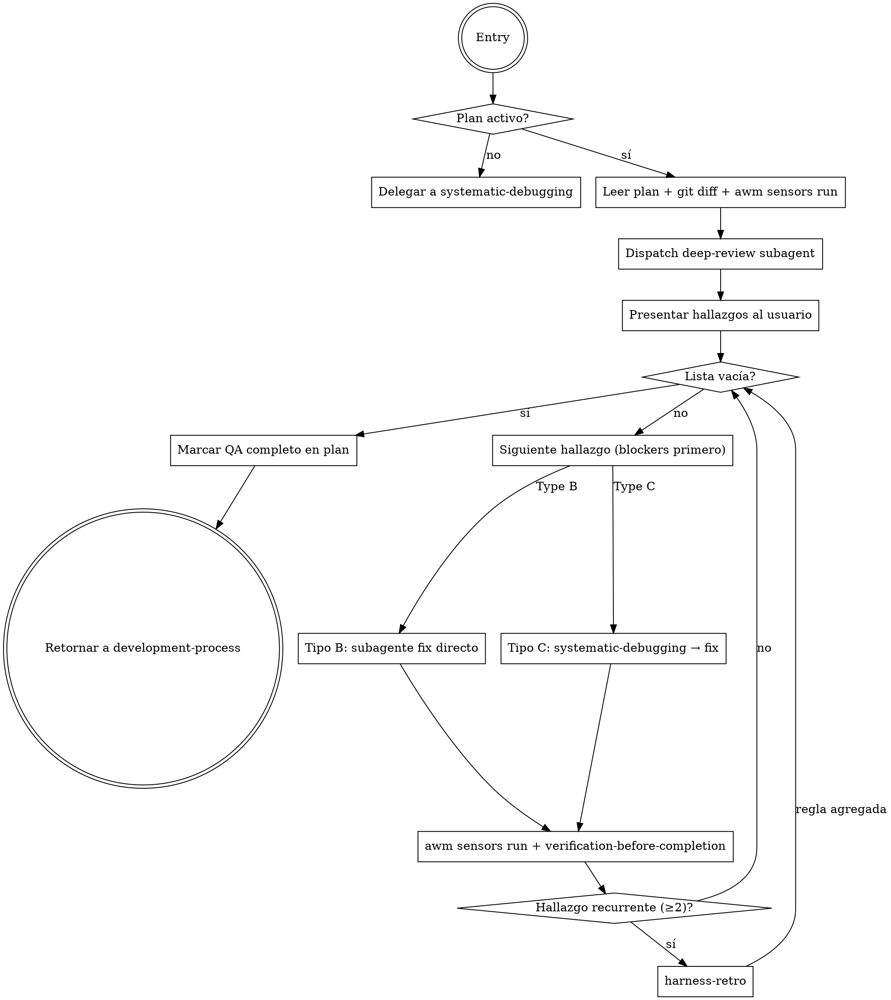

# Post-Implementation QA

**Announce at start:** "I'm using the post-implementation-qa skill to review what was built vs. what was planned."

## Overview

El harness previene bugs futuros (preventivo). Este skill cierra los bugs encontrados ahora (correctivo). Corre entre ejecución y finishing, reemplazando el prompt informal de "review total antes de cerrar".

**Core principle:** Ninguna rama se cierra sin evidencia de que lo construido coincide con lo planeado Y de que el código es correcto.

## Dos Entry Points

### Entry Point 1 — Desde development-process (desarrollo activo)
Invocado cuando `subagent-driven-development` o `executing-plans` reporta todas las tareas completas. El plan está disponible en `docs/plans/`.

### Entry Point 2 — Standalone
El usuario invoca directamente al encontrar un bug o querer un QA pass sin desarrollo previo.
- Si existe `*-plan.md` para la rama actual en `docs/plans/` → úsalo como referencia
- Si no hay plan → delegar directamente a `systematic-debugging`

## Tipos de Hallazgos

| Tipo | Descripción | Remediación |
|------|-------------|-------------|
| **B — Fidelidad** | El plan dice X, el código hace Y (falta algo, sobra algo, mal entendido) | Subagente de corrección apuntado al gap, sin root cause analysis |
| **C — Calidad** | Bug lógico, edge case, comportamiento inesperado | `systematic-debugging` → root cause → subagente fix |

> **Lente de seguridad (alcance ≠ exención).** "Documentado-fuera-de-alcance" NO exime invariantes de seguridad/robustez. Una función pública que devuelve `Infinity`/`NaN`/`undefined` en silencio, o que crashea con entradas límite/inválidas, es un hallazgo **Type C aunque el diseño lo haya declarado fuera de alcance.** El alcance excluye *features*, nunca el piso de robustez.

## El Proceso



## Paso a Paso

### Paso 1: Localizar el plan activo

```bash
git branch --show-current
ls docs/plans/ | grep -v design | sort | tail -5
```

Si no hay plan para la rama actual → standalone mode → `systematic-debugging`.

### Paso 2: Reunir evidencia

```bash
git diff main...HEAD
awm sensors run
```

### Paso 3: Dispatch del subagente de revisión profunda

**Construir el prompt DESDE el template `./deep-review-prompt.md`** — leer el archivo e inyectar el contexto en su estructura. Un prompt inline escrito de memoria pierde la instrucción de ledger. Inyectar:
- Texto completo del plan
- Git diff completo de la rama
- Output completo de `awm sensors run`

El subagente retorna JSON con lista de hallazgos clasificados.

- El subagente además registra cada hallazgo y win en el ledger vía `awm ledger add` (ver deep-review-prompt.md), insumo de `harness-retro`.

### Paso 4: Presentar hallazgos al usuario

**Gate de ledger (antes de presentar):** correr `awm ledger list` y verificar que cada hallazgo del JSON tiene su entrada correspondiente (fase `post-qa`). Si el subagente reportó N hallazgos pero el ledger no creció, el pipeline de aprendizaje está roto — re-despachar al subagente para que emita los `awm ledger add` faltantes antes de continuar. No presentar hallazgos cuyo registro no existe.

```
## Hallazgos QA

Type B — Fidelidad (N hallazgos)
  [B1] 🔴 BLOCKER: Falta implementar X (plan sección 3.2)
  [B2] 🟡 IMPORTANT: Feature Y no estaba en el plan

Type C — Calidad (M hallazgos)
  [C1] 🔴 BLOCKER: Edge case Z no manejado (file.ts:45)
  [C2] ⚪ MINOR: Mensaje de error poco claro

Resumen: N Type-B, M Type-C. K blockers.
```

Preguntar: "¿Procedemos con todos los hallazgos, o hay alguno que quieras descartar?"
Esperar confirmación antes de iniciar el fix loop.

### Paso 5: Fix loop (blockers primero, luego importantes, luego minors)

**Para Type B:**
- Dispatch subagente con descripción exacta del gap + sección del plan relevante
- Sin root cause analysis — el gap está claro del plan
- Después del fix: `awm sensors run` + `verification-before-completion`

**Para Type C:**
- Invocar `systematic-debugging` → root cause confirmado → dispatch subagente fix
- Después del fix: `awm sensors run` + `verification-before-completion`

**Si el mismo hallazgo aparece ≥2 veces:** invocar `harness-retro` antes de continuar.

**Si el usuario descarta un hallazgo:** anotar el motivo y continuar.

### Paso 6: Gate de completion

Solo proceder cuando TODOS:
- [ ] Lista de hallazgos vacía (todos resueltos o descartados con motivo)
- [ ] `awm sensors run` limpio
- [ ] `verification-before-completion` pasado para cada fix

### Paso 7: Marcar QA completo

Agregar al comienzo del plan (primera línea después del header `#`):
```markdown
<!-- awm-qa-complete: YYYY-MM-DD -->
```

Reportar: "QA completo. N hallazgos encontrados y cerrados. Listo para `finishing-a-development-branch`."

## Ley de Hierro

```
NO CLAIM DE "QA COMPLETO" SIN:
1. awm sensors run limpio
2. verification-before-completion por cada fix
3. Lista vacía o descartes justificados
```

## Red Flags

- "Solo un fix rápido, no necesito correr sensores" → CORRER SENSORES
- "La implementación se ve bien" → EVIDENCIA, no apariencias
- "Este hallazgo es menor, lo salto" → presentar al usuario, que decida
- Mezclar tratamiento Type B y C
- Saltar confirmación antes del fix loop
- Olvidar el marker `<!-- awm-qa-complete -->`
- Despachar el deep-review con prompt inline en vez del template → se pierde la instrucción de `awm ledger add`
- Presentar hallazgos sin verificar que el ledger creció (gate del Paso 4)

## Conexiones

| Skill | Rol |
|-------|-----|
| `development-process` | Lo invoca como nueva fase |
| `systematic-debugging` | Para hallazgos Type C |
| `subagent-driven-development` | Ejecuta los fixes |
| `verification-before-completion` | Gate por cada fix |
| `harness-retro` | Si hallazgo es recurrente (≥2) |
| `finishing-a-development-branch` | Fase siguiente cuando QA está limpio |
