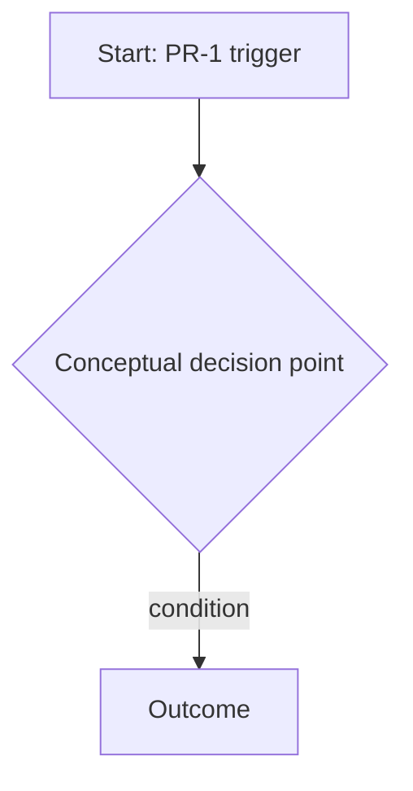

<!--
  product-brief template — skeleton only, not a real brief.
  Fill every section for the actual project; do not leave any <!-- guidance --> comment
  or bracketed placeholder in the delivered document. Section order and frontmatter
  shape are normative — see skills/readiness-gate/references/brief-contract.md.
  Reconstructed from the brief-spec normative rules (the original template does not exist
  — see docs/plans/2026-07-22-product-layer-audit.md).
-->

---
awm: product-brief
schema: 1
title: <short name>
mode: brief
readiness: draft
created: YYYY-MM-DD
updated: YYYY-MM-DD
open_decisions: [DA-1, DA-3]
project: <slug or null>
---

# <Project/Feature Title> — Product Brief

<!-- guidance: one-line header restating audience and methodology, e.g.
     "Audience: implementing agent (Claude Code) · Methodology: brief-spec (AWM product-brief)" -->

## Business Need

<!-- guidance: one or more N# entries. Each names the problem, who bears its cost, and the
     cost of leaving it unresolved. State the need as observed/reported by the owner, not
     as a solution already chosen. -->

- **N1** — <who bears the pain> currently <problem>, costing <quantified or qualified cost
  of leaving it unresolved>.
- **N2** — <second need, if any>.

## Business Cases

<!-- guidance: the catalog of cases, exceptions, and rules this brief must cover — not just
     the happy path. This is what readiness-gate's G4 checks; a brief that only describes
     the main flow fails this criterion. Descriptive bullets, no ID scheme — same style as
     Users & Context/Constraints below. If this brief followed a product-discovery session,
     copy its Phase 3 catalog here rather than re-deriving it. -->

- <primary case>: <what happens, what the system must do>.
- <exception/edge case>: <what happens, what the system must do>.
- <variant or rule>: <what happens, what the system must do>.

## Users & Context

<!-- guidance: who uses or suffers this, and in what context they encounter it (device,
     channel, frequency, urgency). This is what readiness-gate's G2 checks — without
     concrete names/roles here, the criterion fails. Descriptive bullets, no ID scheme —
     the contract does not define one for this section (unlike N#/PR-#/RF-x.y/DA-#). -->

- <role/persona> encounters this when <context/trigger>, via <channel>.
- <second user group, if any>.

## Constraints

<!-- guidance: technical, cost, privacy, and untouchable-infrastructure limits the solution
     must respect. This is what readiness-gate's G5 checks. Constraints are hard limits
     already known — not open decisions (those go in "Open Decisions" below). Descriptive
     bullets, no ID scheme — the contract does not define one for this section. -->

- Technical: <e.g. must run on existing infra X; cannot introduce dependency Y>.
- Cost: <e.g. no new paid subscriptions without owner sign-off>.
- Privacy/NDA: <e.g. data category Z cannot leave the current boundary>.

## Non-Assumption Mandate

<!-- guidance: this section is the methodology's core safeguard. It must state plainly that
     this brief was built without access to the code, list EVERYTHING not verified, and
     make explicit that contradictions between this brief and the real system are reported
     to the owner — never silently resolved by assuming. -->

This brief was constructed without access to the running system's code or data. The
following have **not** been verified and must be confirmed in R0 (read-only discovery)
before any technical commitment is made:

- Entity names and schemas: <e.g. "the exact shape of the `<entity>` record">.
- Integrations: <e.g. "whether `<external system>` exposes a webhook or requires polling">.
- Naming/coding conventions currently in use in the target codebase.
- External payload formats: <e.g. "the real shape of `<third-party>`'s response">.
- Deployment/runtime mechanism the solution will run under.

Any contradiction found between this brief and the real system during R0 is reported to
the project owner and never resolved by assuming — the owner decides, and the resolution
is recorded (as an update to this brief or a new `DA-#`). All schema, route, and signature
definitions are delegated to the implementer, to be produced only after R0 discovery.

## Glossary

<!-- guidance: domain terms used elsewhere in this document, defined once so requirements
     don't silently redefine vocabulary. -->

| Term | Definition |
|------|------------|
| <term> | <definition, one sentence> |

## Processes

<!-- guidance: PR-# entries describing the business processes this brief covers. Behavior
     and rules only — never technology/implementation. If a process depends on something
     unverified, say so inline ("if R0 confirms X; otherwise, fallback Y"). Use a Mermaid
     state diagram (lifecycle) or flowchart (flow) only for what was conceptually agreed. -->

- **PR-1** — <process name>: <description of the business behavior/rule, step by step>.
  - If R0 confirms <unverified assumption>, then <path A>; otherwise <fallback B>.

## Requirements

<!-- guidance: RF-x.y (functional) and RNF-x.y (non-functional, RNF-T.# for cross-cutting)
     entries. Write each RF/RNF so the development-engine brainstorming can derive its EARS
     `## Requirements` without rework: one testable SHALL-style claim per ID. Prefer
     WHEN/IF/THE <system> SHALL <response> phrasing; every requirement gets a CA-x.y
     acceptance criterion, executable against real data/usage, never mocks only. -->

- **RF-1.1** — WHEN <trigger>, THE <system/process> SHALL <testable response>.
  - **CA-1.1** — <executable acceptance criterion tied to RF-1.1>.
- **RF-1.2** — IF <error/edge condition>, THEN THE <system/process> SHALL <testable response>.
  - **CA-1.2** — <executable acceptance criterion tied to RF-1.2>.
- **RNF-1.1** — THE <system> SHALL <non-functional property, e.g. performance/availability>.
  - **CA-1.3** — <executable acceptance criterion tied to RNF-1.1>.
- **RNF-T.1** — (cross-cutting, applies to all processes) THE <system> SHALL <property>.

## Open Decisions

<!-- guidance: DA-# table. Every row needs a "blocks" value (which release cannot start
     without resolving it, or "none") — a DA with no blocks value fails readiness-gate's G8.
     Never resolve an owner's ambiguity by choosing for them here instead. -->

| ID | Decision | Blocks | Known Positions |
|----|----------|--------|------------------|
| DA-1 | <open question> | Release 1 | <option A> / <option B> |
| DA-2 | <open question> | none | <option A> / <option B> |

## Out of Scope

<!-- guidance: explicit boundary of what this brief does not cover. Same seriousness as
     scope — omitting this fails readiness-gate's G3. -->

- <explicitly excluded item, and why>.
- <second excluded item>.

## Releases

<!-- guidance: release slices, each independently valuable. Order by business value (what
     replaces the cost/pain that motivated the project goes first), not technical
     dependency — and write the justification. No release starts before the prior
     release's CAs are met and its blocking DAs are resolved. -->

### Release 1 — <name>

- **Value:** <one-line independent productive value justification>.
- **Scope:** <RF/RNF IDs covered>.
- **Blocked by:** <DA-# IDs that must resolve first, or "none">.
- **Acceptance:** <CA-# IDs that must pass>.

### Release 2 — <name>

- **Value:** <one-line independent productive value justification>.
- **Scope:** <RF/RNF IDs covered>.
- **Blocked by:** <DA-# IDs that must resolve first, or "none">.
- **Acceptance:** <CA-# IDs that must pass>.

## Risks

<!-- guidance: risk/impact/mitigation table. The risk "contradictions between brief and
     real system" is always included, mitigated by the non-assumption mandate + R0. -->

| Risk | Impact | Mitigation |
|------|--------|------------|
| Contradictions between this brief and the real system | Rework, incorrect implementation | Non-assumption mandate + R0 read-only discovery before any commitment |
| <second risk> | <impact> | <mitigation> |
