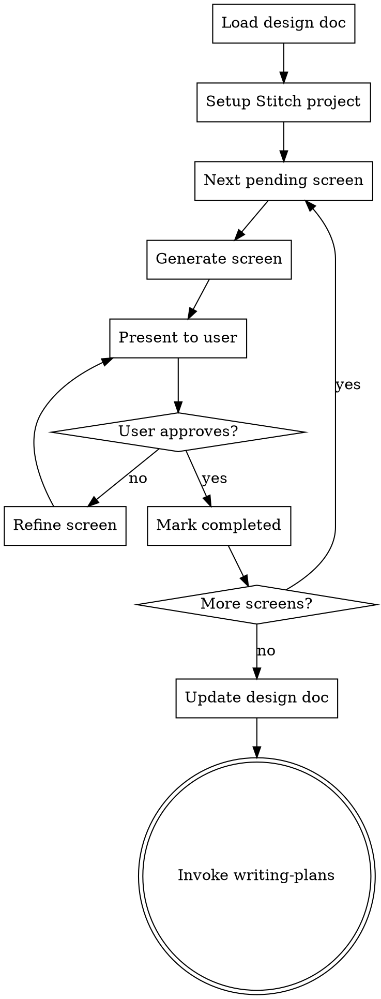

# UI Design with Google Stitch

## Overview

Design UI screens using Google Stitch via MCP. This skill reads the `## UI Screens` table from an approved design doc, generates each screen in Stitch, iterates with the user until approved, and updates the design doc with Stitch references.

**Announce at start:** "I'm using the ui-design skill to design UI screens with Stitch."

<HARD-GATE>
Do NOT write any implementation code. This skill only produces visual designs in Stitch and updates the design doc with references. Implementation happens later in the pipeline via writing-plans → execution.
</HARD-GATE>

## Checklist

You MUST create a task for each of these items and complete them in order:

1. **Load design doc** — find and read the design doc, extract the `## UI Screens` table
2. **Setup Stitch project** — list projects to find or create one for this feature, then detect or create design system
3. **Design screens** — generate each pending screen one by one, iterate with user until approved
4. **Update design doc** — update the table with Stitch references, commit
5. **Transition to planning** — invoke writing-plans skill

## Process Flow



**The terminal state is invoking writing-plans.** Do NOT invoke any other skill.

---

## Step 1: Load Design Doc

1. Scan `docs/plans/` for the most recent `*-design.md` that contains a `## UI Screens` section.
2. Parse the table to extract screens with their fields: Screen, Description, Device, Status.
3. Filter to only screens with status `pending`.
4. If no design doc with `## UI Screens` section is found at all, inform the user: "The ui-design skill requires a completed brainstorming design doc with a `## UI Screens` section. Please run brainstorming first." Then stop — do NOT proceed.
5. If a design doc exists but has no pending screens (all are completed or skipped), inform the user and invoke `writing-plans` immediately.

**Expected table format:**

```markdown
## UI Screens

| Screen | Description | Device | Status |
|--------|-------------|--------|--------|
| Login  | Login screen with email and OAuth | MOBILE | pending |
```

---

## Step 2: Setup Stitch Project

### Detect existing project

1. Call `list_projects` to check if a project with the feature name already exists.
2. If found, reuse it. If not, create one with `create_project`.

**Project naming convention:** Use the feature/topic name from the design doc filename. For example, `2026-03-25-checkout-flow-design.md` → project title "Checkout Flow".

### Design system

1. Call `list_design_systems` for the project.
2. **If a design system exists:** Reuse it silently. Inform the user which design system is active.
3. **If no design system exists:** Ask the user how they want to define the visual identity:

Present these options:
> "No design system found for this project. How would you like to define the visual identity?"
>
> **A) Describe the vibe** — Tell me the style you want (e.g., "minimalist, dark colors, rounded corners") and I'll generate a design system
>
> **B) Derive from reference** — Provide a URL or image with existing branding to extract the visual identity
>
> **C) Skip** — Don't use a design system; each screen will use Stitch's default styling

- **Option A:** Take the user's description, call `create_design_system` with the appropriate properties (colors, typography, roundness, colorMode), then `update_design_system` to finalize it.
- **Option B:** Use the reference to inform the design system properties, call `create_design_system` + `update_design_system`.
- **Option C:** Proceed without a design system.

If a design system was created or exists, call `apply_design_system` after generating each screen to ensure the design system is applied. Pass the screen instance IDs returned from `generate_screen_from_text`.

---

## Step 3: Design Screens (one by one)

For each screen with status `pending`, in the order listed in the table:

### 3a. Generate

1. Build a prompt combining:
   - The screen's Description from the table
   - Relevant context from the design doc (feature summary, user flows, constraints)
   - Any design system context (if active)
2. Call `generate_screen_from_text` with:
   - `projectId`: The Stitch project ID
   - `prompt`: The constructed prompt
   - `deviceType`: Map the Device column — `MOBILE`, `DESKTOP`, `TABLET`, or `AGNOSTIC`
   - `modelId`: `GEMINI_3_1_PRO` by default (high quality)
3. Generation takes a few minutes. Do NOT retry on connection errors — call `get_screen` to check status. Poll `get_screen` until `screenMetadata.status` returns `COMPLETE`. If status is `FAILED`, inform the user and offer to retry. Do not poll more than 10 times (roughly one per 30 seconds).
4. If `output_components` in the response contains suggestions, present them to the user. If accepted, call `generate_screen_from_text` again with the suggestion as the new prompt.

### 3b. Present

Present the generated screen to the user:
- Show the screenshot (Stitch returns a screenshot URL in the response)
- Describe the key UI elements generated
- Ask: *"Does this look good, or would you like changes?"*

### 3c. Iterate (if needed)

If the user requests changes:
- Use `edit_screens` with the user's feedback as the prompt. Make **one major change at a time**.
- Use specific UI/UX keywords in the edit prompt ("navigation bar", "call-to-action button", "card layout").
- Present the result again and ask for approval.
- If the user wants to explore alternatives, use `generate_variants` with appropriate settings:
  - `variantCount`: 2-3
  - `creativeRange`: `REFINE` for small tweaks, `EXPLORE` for broader changes, `REIMAGINE` for radical alternatives
  - `aspects`: As relevant — `LAYOUT`, `COLOR_SCHEME`, `IMAGES`, `TEXT_FONT`, `TEXT_CONTENT`
- Repeat until user approves.

### 3d. Approve

When user approves, record the screen's Stitch screen ID (from the `name` field in the response, format `screens/{id}`).

Inform the user: *"Screen '{name}' approved. Moving to next screen..."* (or *"All screens designed!"* if this was the last one).

**Model override:** If the user requests faster iteration at any point, switch to `GEMINI_3_FLASH` for subsequent generations. Inform: *"Switching to fast mode for quicker iterations."*

---

## Step 4: Update Design Doc

After all screens are approved:

1. Read the current design doc.
2. Replace the `## UI Screens` section with the updated table that includes the Stitch project reference and screen IDs:

```markdown
## UI Screens

> Stitch Project: `projects/{projectId}`

| Screen | Description | Device | Status | Stitch Screen |
|--------|-------------|--------|--------|---------------|
| Login  | Login screen with email and OAuth | MOBILE | completed | screens/xyz1 |
| Dashboard | Main view with key metrics | DESKTOP | completed | screens/xyz2 |
```

3. Commit the updated design doc:

```bash
git add docs/plans/<design-doc-filename>.md
git commit -m "docs: update design doc with Stitch UI screen references"
```

---

## Step 5: Transition to Planning

After committing the updated design doc:

- Invoke the `writing-plans` skill to create the implementation plan.
- Do NOT invoke any other skill. `writing-plans` is the only valid next step.

---

## Key Principles

- **One screen at a time** — Don't batch-generate. Present and approve each individually.
- **One edit at a time** — When refining, make one major change per edit call.
- **Use UI/UX keywords** — "navigation bar", "hero section", "card grid", "floating action button".
- **GEMINI_3_1_PRO by default** — Switch to GEMINI_3_FLASH only if user requests speed.
- **References only** — Store Stitch IDs in the design doc, don't download screenshots or HTML to the repo.
- **No implementation** — This skill designs screens, it does not write code.

---

## Stitch MCP Tools Reference

| Tool | When to use |
|------|-------------|
| `create_project(title)` | Create a new Stitch project for the feature |
| `get_project(name)` | Retrieve project details. Format: `projects/{project}` |
| `list_projects(filter?)` | List projects. Filter: `view=owned` (default) or `view=shared` |
| `list_screens(projectId)` | List all screens in a project |
| `get_screen(name, projectId, screenId)` | Retrieve screen details with htmlCode, screenshot, figmaExport URLs |
| `generate_screen_from_text(projectId, prompt, deviceType?, modelId?)` | Generate a new screen from a text prompt |
| `edit_screens(projectId, selectedScreenIds[], prompt, deviceType?, modelId?)` | Edit existing screens with a change prompt |
| `generate_variants(projectId, selectedScreenIds[], prompt, variantOptions)` | Generate design variants for exploration |
| `create_design_system(designSystem, projectId?)` | Create a new design system |
| `update_design_system(name, projectId, designSystem)` | Update an existing design system |
| `list_design_systems(projectId?)` | List design systems for a project |
| `apply_design_system(projectId, selectedScreenInstances[], assetId)` | Apply design system to specific screens |

**Device types:** `MOBILE`, `DESKTOP`, `TABLET`, `AGNOSTIC`

**Models:** `GEMINI_3_1_PRO` (high quality, default), `GEMINI_3_FLASH` (fast wireframing)

**Variant options:**
- `variantCount`: 1-5 (default 3)
- `creativeRange`: `REFINE` | `EXPLORE` | `REIMAGINE`
- `aspects`: `LAYOUT` | `COLOR_SCHEME` | `IMAGES` | `TEXT_FONT` | `TEXT_CONTENT`
