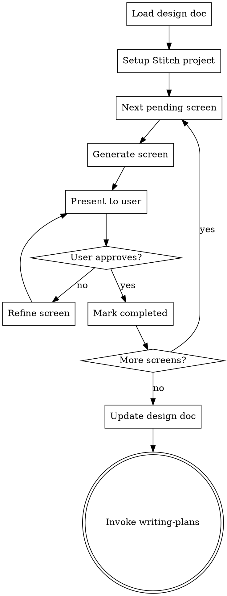

# UI Design with Google Stitch

## Overview

Design UI screens using Google Stitch via MCP. This skill reads the `## UI Screens` table from an approved design doc, generates each screen in Stitch, iterates with the user until approved, and updates the design doc with Stitch references.

**Announce at start:** "I'm using the ui-design skill to design UI screens with Stitch."

<HARD-GATE>
Do NOT write any implementation code. This skill only produces visual designs in Stitch and updates the design doc with references. Implementation happens later in the pipeline via writing-plans → execution.
</HARD-GATE>

## Checklist

You MUST create a task for each of these items and complete them in order:

1. **Load design doc** — find and read the design doc, extract the `## UI Screens` table
2. **Setup Stitch project** — list projects to find or create one for this feature, then detect or create design system
3. **Design screens** — generate, iterate, **download artifacts**
4. **Update design doc** — table with artifact paths, commit doc + artifacts
5. **Transition to planning** — invoke writing-plans skill

## Process Flow



**The terminal state is invoking writing-plans.** Do NOT invoke any other skill.

---

## Step 0: Access Detection

Decide the access layer BEFORE loading the design doc, and announce it to the user. Never abort the phase because Stitch is unreachable.

1. **Layer 1 — Stitch MCP:** if the Stitch MCP tools (`list_projects`, `generate_screen_from_text`, …) are available in your tool list → use them for every Stitch call in this skill. Announce: *"Stitch access: MCP (layer 1)."*
2. **Layer 2 — Stitch CLI:** if no MCP but `STITCH_API_KEY` is set and `npx` exists (`[ -n "$STITCH_API_KEY" ] && command -v npx >/dev/null 2>&1`) → run every Stitch call through Bash: `npx -y @_davideast/stitch-mcp tool <tool_name> <args>`, using the exact syntax from the CLI reference table below. Same logical flow, same tool names. Announce: *"Stitch access: CLI via STITCH_API_KEY (layer 2)."*
3. **Layer 3 — Offline:** neither available → follow the **Offline Mode** section of this skill. Announce: *"Stitch access: none — offline mode (layer 3). Design system and mockups will be generated locally."*

**Mid-flow degradation:** if a layer-2 CLI call fails, announce the failure and degrade to layer 3 for the remaining screens. Use the same failure rule defined under "Error handling (R2.5)" in the Stitch CLI Reference section below: treat any `Error:` in the CLI invocation's output (client-side validation, HTTP 401, or `Tool Call Failed [...]`) as a failed call — do not rely on shell exit code alone, since npx may not always propagate a non-zero exit cleanly. Never degrade silently, and never mark the phase complete pretending Stitch output exists.

---

## Step 1: Load Design Doc

1. Scan `docs/plans/` for the most recent `*-design.md` that contains a `## UI Screens` section.
2. Parse the table to extract screens with their fields: Screen, Description, Device, Status.
3. Filter to only screens with status `pending`.
4. If no design doc with `## UI Screens` section is found at all, inform the user: "The ui-design skill requires a completed brainstorming design doc with a `## UI Screens` section. Please run brainstorming first." Then stop — do NOT proceed.
5. If a design doc exists but has no pending screens (all are completed or skipped), inform the user and invoke `writing-plans` immediately.

**Expected table format:**

```markdown
## UI Screens

| Screen | Description | Device | Status |
|--------|-------------|--------|--------|
| Login  | Login screen with email and OAuth | MOBILE | pending |
```

---

## Step 2: Setup Stitch Project

### Detect existing project

1. Call `list_projects` to check if a project with the feature name already exists.
2. If found, reuse it. If not, create one with `create_project`.

**Project naming convention:** Use the feature/topic name from the design doc filename. For example, `2026-03-25-checkout-flow-design.md` → project title "Checkout Flow".

### Design system

1. Call `list_design_systems` for the project.
2. **If a design system exists:** Reuse it silently. Inform the user which design system is active.
3. **If no design system exists:** Ask the user how they want to define the visual identity:

Present these options:
> "No design system found for this project. How would you like to define the visual identity?"
>
> **A) Describe the vibe** — Tell me the style you want (e.g., "minimalist, dark colors, rounded corners") and I'll generate a design system
>
> **B) Derive from reference** — Provide a URL or image with existing branding to extract the visual identity
>
> **C) Skip** — Don't use a design system; each screen will use Stitch's default styling

- **Option A:** Take the user's description, call `create_design_system` with the appropriate properties (colors, typography, roundness, colorMode), then `update_design_system` to finalize it.
- **Option B:** Use the reference to inform the design system properties, call `create_design_system` + `update_design_system`.
- **Option C:** Proceed without a design system.

If a design system was created or exists, call `apply_design_system` after generating each screen to ensure the design system is applied. Pass the screen instance IDs returned from `generate_screen_from_text`.

---

### Step 2b: Design Intelligence (ui-ux-pro-max — all layers)

Before creating the design system and before generating any screen, consult the `ui-ux-pro-max` skill (invoke it with the Skill tool if not yet loaded):

1. Derive keywords from the design doc: product type + industry + tone (e.g. `"team management dashboard dark professional"`).
2. Run its `--design-system` search with `--persist --output-dir <project-root>` so `design-system/<slug>/MASTER.md` is written as the token artifact.
3. Use the result to drive Stitch:
   - `create_design_system` properties (colors, typography, roundness, colorMode) come from the recommended palette/font pairing.
   - Every `generate_screen_from_text` prompt is enriched with the recommended style vocabulary (style name, key effects, anti-patterns to avoid) — concrete words beat vague vibes.

---

## Step 3: Design Screens (one by one)

For each screen with status `pending`, in the order listed in the table:

### 3a. Generate

1. Build a prompt combining:
   - The screen's Description from the table
   - Relevant context from the design doc (feature summary, user flows, constraints)
   - Any design system context (if active)
2. Call `generate_screen_from_text` with:
   - `projectId`: The Stitch project ID
   - `prompt`: The constructed prompt
   - `deviceType`: Map the Device column — `MOBILE`, `DESKTOP`, `TABLET`, or `AGNOSTIC`
   - `modelId`: `GEMINI_3_1_PRO` by default (high quality)
3. Generation takes a few minutes. Do NOT retry on connection errors — call `get_screen` to check status. Poll `get_screen` until `screenMetadata.status` returns `COMPLETE`. If status is `FAILED`, inform the user and offer to retry. Do not poll more than 10 times (roughly one per 30 seconds).
4. If `output_components` in the response contains suggestions, present them to the user. If accepted, call `generate_screen_from_text` again with the suggestion as the new prompt.

### 3b. Present

Present the generated screen to the user:
- Show the screenshot (Stitch returns a screenshot URL in the response)
- Describe the key UI elements generated
- Ask: *"Does this look good, or would you like changes?"*

### 3c. Iterate (if needed)

If the user requests changes:
- Use `edit_screens` with the user's feedback as the prompt. Make **one major change at a time**.
- Use specific UI/UX keywords in the edit prompt ("navigation bar", "call-to-action button", "card layout").
- Present the result again and ask for approval.
- If the user wants to explore alternatives, use `generate_variants` with appropriate settings:
  - `variantCount`: 2-3
  - `creativeRange`: `REFINE` for small tweaks, `EXPLORE` for broader changes, `REIMAGINE` for radical alternatives
  - `aspects`: As relevant — `LAYOUT`, `COLOR_SCHEME`, `IMAGES`, `TEXT_FONT`, `TEXT_CONTENT`
- Repeat until user approves.

### 3d. Approve

When user approves, record the screen's Stitch screen ID (from the `name` field in the response, format `screens/{id}`).

Inform the user: *"Screen '{name}' approved. Moving to next screen..."* (or *"All screens designed!"* if this was the last one).

**Model override:** If the user requests faster iteration at any point, switch to `GEMINI_3_FLASH` for subsequent generations. Inform: *"Switching to fast mode for quicker iterations."*

### 3e. Download artifacts (MANDATORY — a screen is not `completed` without them)

Immediately after the user approves a screen:

1. Call `get_screen` for the approved screen; extract `htmlCode.downloadUrl` and `screenshot.downloadUrl`.
2. Download both to the repo (create the directory on first use — and if `.gitignore` excludes `.stitch/`, surface it and resolve with the user before continuing):

```bash
mkdir -p .stitch/designs
bash <skill-dir>/scripts/fetch-stitch.sh "<htmlCode.downloadUrl>" ".stitch/designs/<screen-slug>.html"
bash <skill-dir>/scripts/fetch-stitch.sh "<screenshot.downloadUrl>=w1600" ".stitch/designs/<screen-slug>.png"
```

(The `=w{width}` suffix requests full resolution instead of a thumbnail. Use the design's device width: 1600 desktop, 800 mobile.)

3. Verify both files exist and are non-empty (`ls -la .stitch/designs/`). If either download fails, retry once; if it still fails, the screen stays `pending` and you report the failure — do NOT mark it `completed`.
4. Only approved screens get artifacts — never download discarded variants.

---

## Step 4: Update Design Doc

After all screens are approved:

1. Read the current design doc.
2. Replace the `## UI Screens` section with the updated table that includes the Stitch project reference and screen IDs:

```markdown
## UI Screens

> Stitch Project: `projects/{projectId}`

| Screen | Description | Device | Status | Stitch Screen | Artifacts |
|--------|-------------|--------|--------|---------------|-----------|
| Login  | Login screen with email and OAuth | MOBILE | completed | screens/xyz1 | .stitch/designs/login.html · .stitch/designs/login.png |
```

3. Commit the design doc AND the artifacts together:

```bash
git add docs/plans/<design-doc-filename>.md .stitch/designs/ design-system/
git commit -m "docs: design phase artifacts (screens + tokens) for <feature>"
```

---

## Step 5: Transition to Planning

After committing the updated design doc:

- Invoke the `writing-plans` skill to create the implementation plan.
- Do NOT invoke any other skill. `writing-plans` is the only valid next step.

---

## Key Principles

- **One screen at a time** — Don't batch-generate. Present and approve each individually.
- **One edit at a time** — When refining, make one major change per edit call.
- **Use UI/UX keywords** — "navigation bar", "hero section", "card grid", "floating action button".
- **GEMINI_3_1_PRO by default** — Switch to GEMINI_3_FLASH only if user requests speed.
- **Artifact-first** — Every approved screen materializes `.stitch/designs/<slug>.html` + `.png` committed to the repo. Implementation consumes ONLY these artifacts; Stitch (MCP or CLI) is never needed after this phase.
- **No implementation** — This skill designs screens, it does not write code.

---

## Stitch MCP Tools Reference

| Tool | When to use |
|------|-------------|
| `create_project(title)` | Create a new Stitch project for the feature |
| `get_project(name)` | Retrieve project details. Format: `projects/{project}` |
| `list_projects(filter?)` | List projects. Filter: `view=owned` (default) or `view=shared` |
| `list_screens(projectId)` | List all screens in a project |
| `get_screen(name, projectId, screenId)` | Retrieve screen details with htmlCode, screenshot, figmaExport URLs |
| `generate_screen_from_text(projectId, prompt, deviceType?, modelId?)` | Generate a new screen from a text prompt |
| `edit_screens(projectId, selectedScreenIds[], prompt, deviceType?, modelId?)` | Edit existing screens with a change prompt |
| `generate_variants(projectId, selectedScreenIds[], prompt, variantOptions)` | Generate design variants for exploration |
| `create_design_system(designSystem, projectId?)` | Create a new design system |
| `update_design_system(name, projectId, designSystem)` | Update an existing design system |
| `list_design_systems(projectId?)` | List design systems for a project |
| `apply_design_system(projectId, selectedScreenInstances[], assetId)` | Apply design system to specific screens |

**Device types:** `MOBILE`, `DESKTOP`, `TABLET`, `AGNOSTIC`

**Models:** `GEMINI_3_1_PRO` (high quality, default), `GEMINI_3_FLASH` (fast wireframing)

**Variant options:**
- `variantCount`: 1-5 (default 3)
- `creativeRange`: `REFINE` | `EXPLORE` | `REIMAGINE`
- `aspects`: `LAYOUT` | `COLOR_SCHEME` | `IMAGES` | `TEXT_FONT` | `TEXT_CONTENT`

---

## Stitch CLI Reference (Layer 2)

`STITCH_API_KEY` is generated in Stitch → Settings → API key. Export it before invoking the CLI (e.g. `set -a; source .env; set +a`).

All calls use the `tool` subcommand with `-d '<json>'` for arguments (like `curl -d`) and `-o json` for parseable output. Never use positional/per-field flags, and never use `-o raw` (not valid JSON — `util.inspect` format).

| Tool | Exact command | Notes |
|------|----------------|-------|
| `list_projects` | `npx -y @_davideast/stitch-mcp tool list_projects -o json` | No `-d` needed — all fields optional. |
| `create_project` | `npx -y @_davideast/stitch-mcp tool create_project -d '{"title":"<title>"}' -o json` | `title` optional. |
| `get_project` | `npx -y @_davideast/stitch-mcp tool get_project -d '{"name":"projects/<projectId>"}' -o json` | `name` required, format `projects/{project}`. |
| `list_design_systems` | `npx -y @_davideast/stitch-mcp tool list_design_systems -d '{"projectId":"<projectId>"}' -o json` | `projectId` marked optional in the schema but **required in practice** — omitting it returns `Error: Tool Call Failed [list_design_systems]: Request contains an invalid argument.` |
| `create_design_system` | `npx -y @_davideast/stitch-mcp tool create_design_system -d '{"designSystem":{"displayName":"<name>","theme":"<theme-object>"},"projectId":"<projectId>"}' -o json` | `designSystem` (object with `displayName` + `theme`) required; `projectId` optional (empty = global asset). `<theme-object>` is a placeholder — substitute a real `DesignTheme` JSON object (e.g. `{"bodyFont":"INTER","colorMode":"DARK",...}`), not the literal string. The CLI does not validate client-side before sending, so a missing `designSystem` still reaches the server and can create an empty design system asset — always pass it. |
| `generate_screen_from_text` | `npx -y @_davideast/stitch-mcp tool generate_screen_from_text -d '{"projectId":"<projectId>","prompt":"<prompt>","deviceType":"MOBILE"}' -o json` | `projectId` + `prompt` required; `deviceType`/`designSystem`/`modelId` optional. |
| `get_screen` | `npx -y @_davideast/stitch-mcp tool get_screen -d '{"name":"projects/<projectId>/screens/<screenId>"}' -o json` | Only `name` is needed (`projects/{p}/screens/{s}`) even though the schema also lists `projectId`/`screenId` as required — those are deprecated/legacy. Response includes `htmlCode.downloadUrl` and `screenshot.downloadUrl`, same as MCP. **This redundancy is CLI-specific** — the `get_screen(name, projectId, screenId)` signature in the Stitch MCP Tools Reference table above documents the MCP tool itself and is unaffected by this note. |
| `edit_screens` | `npx -y @_davideast/stitch-mcp tool edit_screens -d '{"projectId":"<projectId>","selectedScreenIds":["<screenId1>","<screenId2>"],"prompt":"<prompt>"}' -o json` | `projectId`, `selectedScreenIds` (real JSON array, not a string), `prompt` required. |
| `generate_variants` | `npx -y @_davideast/stitch-mcp tool generate_variants -d '{"projectId":"<projectId>","selectedScreenIds":["<screenId>"],"prompt":"<prompt>","variantOptions":{"count":3}}' -o json` | `projectId`, `selectedScreenIds`, `prompt`, `variantOptions` (object) required. |
| `apply_design_system` | `npx -y @_davideast/stitch-mcp tool apply_design_system -d '{"projectId":"<projectId>","assetId":"<designSystemAssetId>","selectedScreenInstances":[{"id":"<instanceId>","sourceScreen":"projects/<projectId>/screens/<screenId>"}]}' -o json` | `projectId`, `assetId`, `selectedScreenInstances` (array of `{id, sourceScreen}`) required. Source these pairs from `get_project`'s `screenInstances` field, filtering to entries that have `sourceScreen` (skip `DESIGN_SYSTEM_INSTANCE` entries, which use `sourceAsset` instead). |
| `update_design_system` | `npx -y @_davideast/stitch-mcp tool update_design_system -d '{"name":"<designSystemAssetName>","projectId":"<projectId>","designSystem":{"displayName":"<name>","theme":"<theme-object>"}}' -o json` | **Not verified by the Task 1 spike** (outside its scope — the spike only listed this tool as available, without checking its syntax). Command inferred from the MCP signature `update_design_system(name, projectId, designSystem)` following the same `-d`/`-o json` pattern as the other tools in this table. Before relying on this in Layer 2, run `npx -y @_davideast/stitch-mcp tool update_design_system --schema` to confirm exact required fields. |

**Discovery shortcut:** `npx -y @_davideast/stitch-mcp tool <name> --schema` (no `-d`) prints the tool's argument schema plus an auto-generated `example` command — the cheapest way to confirm syntax for a tool not in this table, without spending a real call.

**Error handling (R2.5):** `STITCH_API_KEY` invalid or missing produces different error text depending on the failure mode (HTTP 401 from the server vs. client-side validation before any network call), and exact wording is not guaranteed across CLI versions. Do not match specific error strings — treat **any** `Error:` in the CLI invocation's output (client-side, HTTP 401, or `Tool Call Failed [...]`) as a signal to degrade to Layer 3 (offline). Transport noise like `Stitch Transport Error: [DOMException [AbortError]...]` in stderr is not itself a failure signal if valid JSON still follows on stdout.
